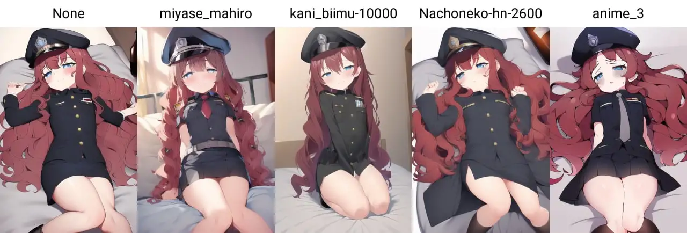

# Hypernetwork

Hypernetworks 是一种新颖的概念，用于在不触及任何权重的情况下微调模型。

[超网络训练指南](https://rentry.org/hypernetwork4dumdums)

::: tip
在设置内勾选 **Move VAE and CLIP to RAM when training hypernetwork. Saves VRAM.** 的效果是将 VAE 模型从显存转移到内存，而非卸载，

如需卸载，请重命名。
:::

你可以在 `train` 选项卡训练 `Hypernetworks`，训练方式与  `Textual Inversion` 相同。

注意，应该使用非常低的学习率，例如 0.000005 或 0.0000005.

如果学习率是 5e-6，步数大约 10000 到 20000。见 [学习率计算器](https://colab.research.google.com/drive/1qzweYEMIFkG6jPa04tD1MhWWOzgSnDvP?usp=sharing) (来自 [Discussion #2670](https://github.com/AUTOMATIC1111/stable-diffusion-webui/discussions/2670))

分辨率设置为要训练的分辨率，最好使用 1:1 的纵横比。

如果数据集的图片不是方形的，请勾选 `Split oversized images into two`

如果你还没有打标签，可以勾选 `Using deepbooru for caption` ，来让 deepbooru 识别标签。

## 网络层结构

`1, 2, 1` 的网络结构代表该网络由两个中间维度为 2x 的全连接层组成。这是目前的默认设置。

添加的数字越多，例如 `1, 2, 4, 2, 1`，超网络的结构就越深。深度超网络适合使用更大的数据集进行训练。

`1, 2, 1` 的 pt 文件大概是 83.8 MB，`1, 2, 2, 1` 大概是 167 MB。如果要扩展的话，一定要注意盘空间是否足够，否则很容易爆盘。

## 层标准化 Layer Normalization

如果勾选，则在每个完全连接层之后添加标准化处理。

防止超网络过拟合，使训练更加稳定。

LN 对防止过拟合使训练更加稳定是有意义的，但是根据之前的测试，linear 开启 LN 的情况，可能学不进去东西，出空包弹。使用激活函数后，LN现在是可使用的。

Swish 似乎并不需要开启 LN，因为 Swish 的训练速度慢，所以应该使用更高的学习率。

## Dropout

启用 Dropout 可以防止超网络过拟合，目前不支持自定义 Dropout 比率，默认为 0.3

在 `1, 2, 1` 的层结构上，dropout 可能只会对小数据集有帮助。

## 激活函数 Activation Functions

关于[激活函数](https://www.geeksforgeeks.org/activation-functions-neural-networks/)，见 [维基百科](https://en.wikipedia.org/wiki/Activation_function)。

激活函数是神经网络中非线性的来源。如果去掉激活函数，神经网络的权重和偏差只会进行线性变换(不管神经网络有多少层，线性运算的复合还是线性运算的)，最终的效果只相当于单层的线性模型。

激活函数对输入进行非线性变换，使其能够学习和执行更复杂的任务，深层神经网络表达能力更加强大。

在 2022/10/21 的一个 [合并请求](https://github.com/AUTOMATIC1111/stable-diffusion-webui/pull/3199) 中，这项功能被 discus0434 提出。

支持 ReLU、LeakyReLU 和 Linear。选择 Linear (线性) 的效果和没有激活函数一样。

Swish 对比 ReLU 和 Linear 要更好，Swish 适合更大的网络，而 ReLU 可能对 `1, 2, 1` 的超网络带来更好的结果。

[相关的英文指南](https://rentry.org/hypernetwork4dumdums)

[相关的英文讨论](https://github.com/AUTOMATIC1111/stable-diffusion-webui/discussions/2670)

{width=1280 height=434 loading=lazy}

> hypernet对比图, the woman in picture is 24 years old

## 额外注意

在开启 LN 选用激活函数并开启 Dropout 后，超网络没以前那么容易过拟合，但是可能需要更大的学习率进行学习。

[Hypernetwork画风训练经验分享](https://shiina-h.notion.site/shiina-h/Hypernetwork-1fc0b60645284c5e96bb41b583a4e86f)

