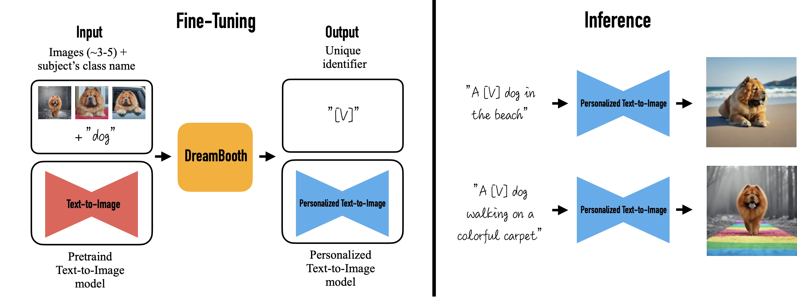
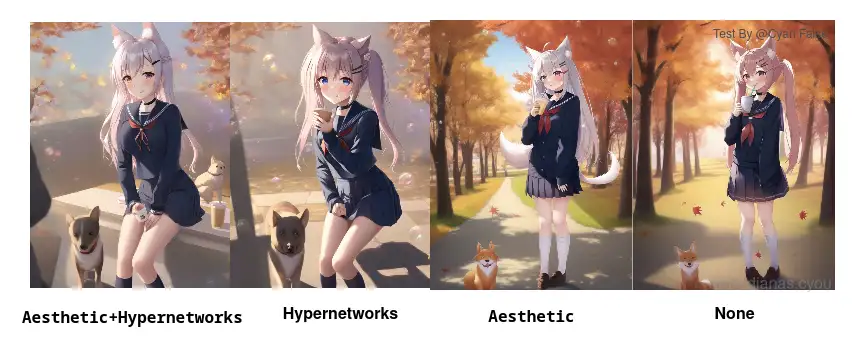

# 模型精调

这节对显卡显存大小的要求较高。训练前，需要确定至少有 8 GB 专用显存。大规模的模型训练可能需要至少 12 GB 专用显存。

## 模型训练的不同方法

如果你在 `--medvram` 参数下开始训练，可能会出现 `RuntimeError: Expected all tensors to be on the same device` 错误，无法创建训练。
这是优化机制导致的[问题](https://github.com/AUTOMATIC1111/stable-diffusion-webui/issues/2399)，WebUI 在 [这次提交](https://github.com/AUTOMATIC1111/stable-diffusion-webui/commit/cbb857b675cf0f169b21515c29da492b513cc8c4) 中允许了在 `--medvram` 下创建 embedding 的情况。请更新版本到这个版本之后。

<!-- **关于 batch size**

更大的 batch size 可能稍微加快训练并稍微提升训练效果，但也需要更大的显存。 -->

> fine tune = hn/TI/DreamArtist (APT)/DB/native training etc.  
> fine tune directly = DB/native training

### Textual Inversion (TI)

从一些具有共同语义 `[V]` 的图片中，提取 `[V]` 的一个方法。提取出的 `[V]` 张量称之为 "Embedding"。将 Embedding 保存为文件，之后生成图片时就可以在提示词中使用文件名方便引用。

#### 特征

训练产物较小 (`.pt` 文件多数只占用数十 KB 空间)，WebUI 自带训练支持。

可以解决新出的角色画不出的问题，或者模仿特定的可以用语言精确描述的艺术风格。

因为 TI 是在 Text Encoder 的输出做处理，并不涉及图像生成本身，所以并不能让模型学习到未知概念。

#### 使用

使用时，将 embedding（一个 `.pt` 、一个 `.bin` 文件或新版图片格式 `.png` / `.webp` / `.avif` / `.jxl`）放入 webui 的 `embeddings` 目录并在提示词中提及使用到的 `embedding` 的文件名（不包括扩展名）。添加或更换模型无需重启 webui。可以同时使用多个 embedding。

如果你使用 DreamArtist ，则将 `*-neg.pt` 一并放入 `embeddings` 目录，在积极和消极提示词中同时使用它们即可。

#### 相关

- [webui 给的英文说明和效果图](https://github.com/AUTOMATIC1111/stable-diffusion-webui/wiki/Textual-Inversion)
- [相关 embeddings](https://gitlab.com/16777216c/stable-diffusion-embeddings)，里面有相关效果预览。
- [list of Textual Inversion embeddings for webui(SD)](https://rentry.org/embeddings)
- [HuggingFace 的 embedding 库](https://cyberes.github.io/stable-diffusion-textual-inversion-models/)

### Hypernetwork (HN)

一类给模型生成权重的网络，在这里是给 LDM (潜在扩散模型) 生成权重。是一个较为实验性的方法，NovelAI 率先探索了在 LDM 上使用。

#### 特征

与 TI 不同，Hypernetwork 会改动 LDM 本身的权重，所以可以训练出无法用语言精确表述的细节，也更适用于画风的训练。

训练产物大小中等，大多在 80 - 160 MB 上下，WebUI 自带训练支持。

#### 使用

::: tip
由于 Embedding 与 Hypernetwork 共用 `.pt` 扩展名，加载时需要予以区分。主要的区分手段为文件大小。
:::

使用时，将 `.pt` 文件放入 `/models/hypernetworks` 并在设置页面的 `hypernetworks` 下拉菜单中启用它。

NAI 泄露包中的 `stableckpt/modules/modules` 文件夹有 NovelAI 训练的一些 Hypernetwork。

### DreamBooth (DB)

直接微调 LDM 和 Text Encoder 以适应用户特定的图像生成需求的一个方法。

> 你能想象你自己的狗环游世界，或者你最喜欢的包在巴黎最独特的展厅里展示吗？你的鹦鹉成为一本插图故事书的主角呢？

#### 特征

与 TI 和 HN 不同，DreamBooth 可以做到出图和训练集高度相似但是却不失泛化能力，用于训练特定具象概念（比如一个角色穿着特定衣服）效果特别好。但是不像 TI 和 HN 像完整权重的 “插件” 一样即插即用，强度也不可调。

这个模型并非为学习画风（抽象概念）而设计。但似乎可以一定程度上适应“画风”。具体效果交由读者你实验。

训练产物较大，使用 `.ckpt` 扩展名，大多在 2 - 4 GB 上下。

#### 使用

操作方法同一般模型，把 DreamBooth 训练出的 `.ckpt` 文件放进 webui 的 `models\Stable-diffusion` 目录里，在 webui 的左上角切换即可使用。

{style="background-color: #fff;" width=3178 height=1186 loading=lazy}

官网 https://dreambooth.github.io/

论文 https://arxiv.org/abs/2208.12242

### Advanced Prompt Tuning (APT)

> "Can super dramatically improve the image quality and diversity"

[Pull Here](https://github.com/AUTOMATIC1111/stable-diffusion-webui/pull/2945)

添加对否定词的即时嵌入学习，以显着提高生成图像的质量。 高质量的概念可以从单个图像中学习。 

添加重建损失以提高生成图像的细节质量和丰富度。

添加通过人工注释训练的鉴别器（使用 convnext 实现）允许嵌入基于模型进行学习。 

### Aesthetic Gradients

微调 CLIP 以适应某个特定生成需求的方法，可以和 TI 一样起到缩短 prompt 的作用。可能略微提升出图的质量。

这项技术通过在生成时计算每个图片的权重，提供了一个 `我不说你应该懂往哪里训练` 的功能。使 AI 更聪明地调整并增加细节。

此项功能来自这个 [存储库](https://github.com/vicgalle/stable-diffusion-aesthetic-gradients)，在 [这次提交](https://github.com/AUTOMATIC1111/stable-diffusion-webui/commit/2b91251637078e04472c91a06a8d9c4db9c1dcf0) 中，此功能被剥离为插件。


#### 特征

通过这项技术，你不需要通过 过多提示词 来提升图片的质量，而是保持作品原始的总体构图，并提高美观度。在少量提示词情况下也可以生成效果不错的作品。

据 [暗影·夜光所言](https://www.bilibili.com/read/cv19102552)，添加 25% 以内的权重，就可以稍微改善画面的美观度而不影响内容。美学 与 Hypernetworks 让 AI 作品更接近原画师风格，但是美学权重本身效果并不好。需要配合 Hypernetworks 超网络。

训练这项模型很快，但是在每一次生产时都会重新为图片计算一次，所以出图很慢。

注意：当种子改变时，训练结果也会改变。

#### 使用

你可以使用下面的 Git 命令来安装这个东西。

```cmd
git clone https://github.com/AUTOMATIC1111/stable-diffusion-webui-aesthetic-gradients extensions/aesthetic-gradients
```

安装后，在 webui 的 `extensions` 文件夹下面创建 `aesthetic-gradients` 文件夹。

使用时，把 `.pt` 文件放在 `models/aesthetic_embeddings/`

然后重启程序，你就可以在 Img2Img 中使用此项功能。

{width=866 height=351 loading=lazy}

## 如何选择

综述。Textual Inversion  和 Hypernetwork 适用于 **整体靠近**，前者教 AI 用模型中的标签组成一个 **人物**，后者也是类似的。区别在于 Hypernetwork 以调节模型权重为手段，而 Textual Inversion 告诉 AI 特定标签应该如何组成。

而 DreamBooth 适用于 **细节** 的模仿，它的训练过程 **重新整改** 了模型，新模型之中含有了新的样本特征（加了新东西），DreamBooth 技术本身用于 **复刻**，所以可以认识冷门元素。

至于 Aesthetic Gradients ，也就是给 AI 认识一组 **优秀的数据**。结果就是这个东西会增加细节，训练很简单，但是会拖慢生成图片的速度(每次生成都要重新计算)。并不适合应用。

## 附录

- [WD 1.4 tagger for Automatic1111's Web UI](https://github.com/toriato/stable-diffusion-webui-wd14-tagger)
- [Resize Tool](https://www.birme.net/)
- [sd-tagging-helper 打标工具](https://github.com/arenatemp/sd-tagging-helper)
- [naifu-diffusion](https://github.com/Mikubill/naifu-diffusion)
