# 魔法进阶

调参基本原理模糊的说是：限定好的数据范围内相似样本越多，越稳定。

## 提示词原理

### 图像生成器

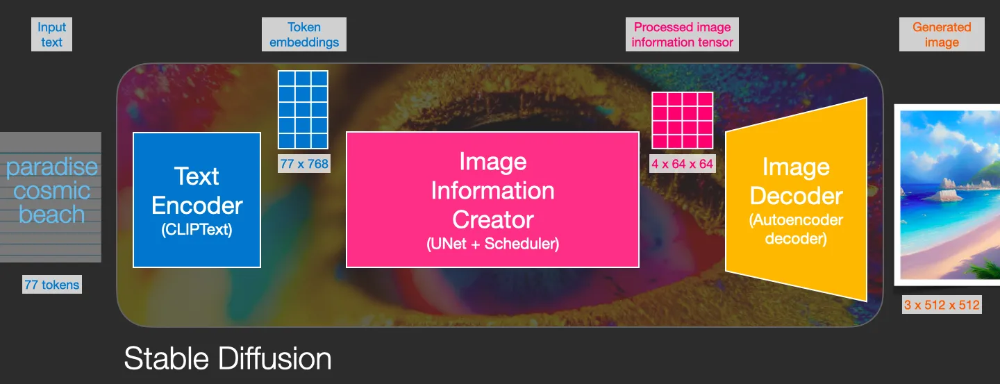{width=1440 height=553 loading=lazy}

information creator 完全在图像信息空间（或潜伏空间）中工作。这一特性使它比以前在像素空间工作的扩散模型更快。在技术上，这个组件是由一个 UNet 神经网络和一个调度算法组成的。

#### Text Encoder

提示词的解析由 Text Encoder/CLIP 处理 (token embedding)，这里是提示词转译给 AI 的关键一步。

ClipText 用于文本编码。

输入文本，输出 77 个标记嵌入向量，每个都有 768 个维度。

#### information creator

UNet + Scheduler 在信息（潜在）空间中逐步处理/分散信息。

它输入文本嵌入和一个由噪声组成的起始多维数组（结构化的数字列表，也叫张量），输出一个经过处理的信息阵列。

#### Image Decoder

Text Decoder 根据从 information creator 那里获得的信息绘制一幅图画。 它只在过程结束时运行一次以生成最终图像。

Autoencoder Decoder 使用处理过的信息阵列绘制最终图像的解码器。输入处理过的信息阵列 (dimensions: (4,64,64))，输出结果图像 (dimensions: (3, 512, 512)，即 (red/green/blue, width, height)。

#### CLIP 的工作

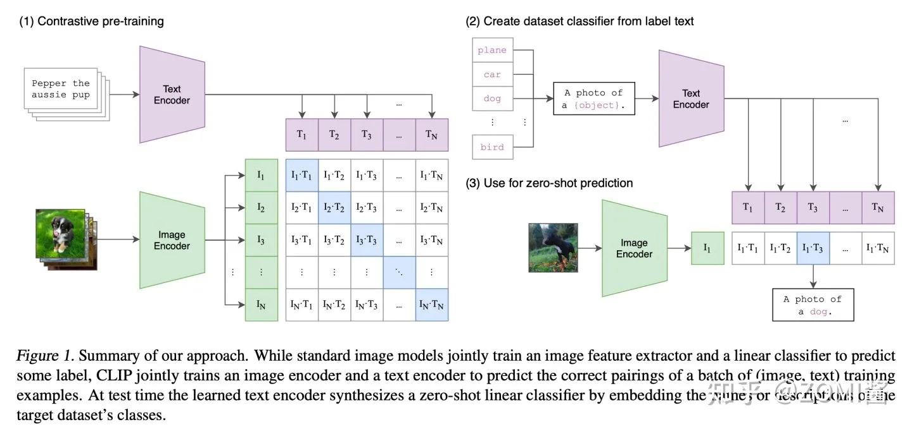{width=1440 height=679 loading=lazy}

> CLIP 训练图 from https://bbs.huaweicloud.com/blogs/371319

Stable Diffusion 中使用的自动编码器的缩减系数为 8。这意味着一张 (4, 512, 512) 的图像在潜在空间中是 (4, 64, 64)。

在使用稳定扩散推理一张 512 x 512 的图片的过程中，模型用一个种子和一个文本提示作为输入。潜在种子生成大小 64 × 64 的随机潜在图像，而 prompt 进入 Text Encoder 通过 CLIP 的文本编码器转化为大小为 77 × 768 的文本嵌入。

U-Net 在以文本嵌入为条件的同时迭代地对随机高斯噪声表示进行去噪。U-Net 通过 采样算法 计算去噪的潜在图像表示，输出噪声残差。这个步骤重复许多次后，潜在表示由 Image Decoder 的 auto encoder 的解码器解码输出。

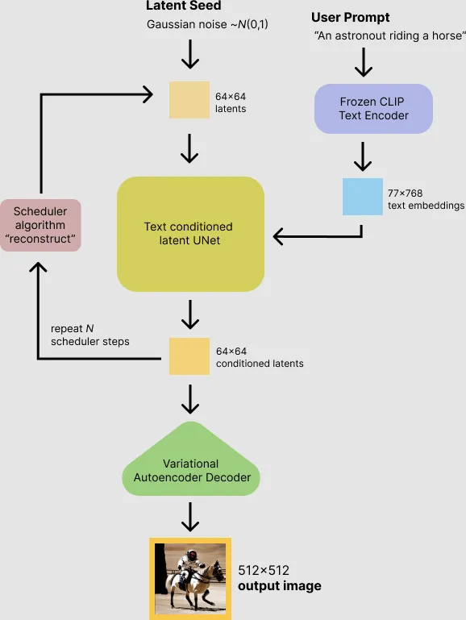{width=578 height=769 loading=lazy}

扩展阅读：

-   [什么是扩散模型？ ](https://lilianweng.github.io/posts/2021-07-11-diffusion-models/)
-   [illustrated-stable-diffusion](https://jalammar.github.io/illustrated-stable-diffusion/)
-   [稳定扩散](https://huggingface.co/blog/stable_diffusion)
-   [稳定扩散入门](https://pub.towardsai.net/getting-started-with-stable-diffusion-f343639e4931)
-   [Stable Diffusion From Wikipedia](https://en.wikipedia.org/wiki/Stable_Diffusion)

#### WebUI 的实现

[WebUI 的 prompt_parser](https://github.com/AUTOMATIC1111/stable-diffusion-webui/blob/master/modules/prompt_parser.py) 通过本地 WebUI 实现了渐变等功能。

WebUI prompt 语法会转换为相应时间的 prompt，然后通过 embedding 交给 Ai 处理。

关于权重的实现：权重增加通常会占一个提示词位。

关于渐变的实现：到了指定 Step，WebUI 程序会替换对应提示词，达到渐变效果。

其他以此类推。

整个看下来，原理流程如图 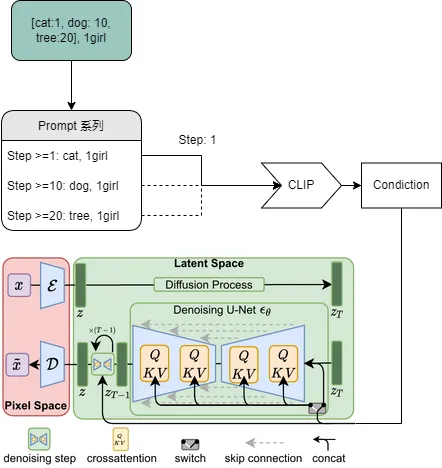{width=442 height=468 loading=lazy}

> By RcINS

你可以在 [illustrated-stable-diffusion](https://jalammar.github.io/illustrated-stable-diffusion/) 看到全面的介绍。本节部分内容也是由此翻译。

## Img2Txt

生成按钮下有一个 `Interrogate CLIP`，点击后会下载 `CLIP`，用于生成当前图片框内图片的 Tag 并填充到提示词。

CLIP 询问器有两个部分：一个是 BLIP 模型，它从图片中创建文本描述。另一种是 CLIP 模型，它会从列表中挑选出与图片相关的几行

::: tip
本文件为 [model_base_caption_capfilt_large.pth](https://storage.googleapis.com/sfr-vision-language-research/BLIP/models/model_base_caption_capfilt_large.pth)

大小为 855MB
:::

## Img2Img 介绍

一般我们有两种途径对图像进行修复：**PS 和 InPaint**，使用方法也十分多样。

WebUI 使用 `--gradio-img2img-tool color-sketch` 启动会带入一个插件对图片进行颜色涂抹(这里不是 Inpaint)

::: tip 不同之处
PS 重新绘画投入 Img2Img 的话，会导致画风的变动，而 Inpaint 就不会。
:::

### 调整大小

-   Just resize : 将图像调整为目标分辨率。除非高度和宽度完全匹配，否则图片会被挤压
-   Crop and resize：调整图像大小，使整个目标分辨率都被图像填充。裁剪多余部分。
-   Resize and fill：调整图像大小，使整个图像在目标分辨率内。用图像的颜色填充空白区域。

## Img2Img 三渲二

调整 3D 模型骨架比寻找样图更容易。

可以结合 **3D 建模** 摆 Pose，也可以使用 MMD 相关软件。

如果是真人图片，需要适当提高 `CFG Scale` 相似度，结合提示词一起生成。降噪 `Denoising` 越高，相关性越低。

推荐使用 [DAZ](https://www.daz3d.com/get_studio) 或者 [Blender](https://www.blender.org/) 或者 Unity ，在对 3D 模型的测试中，**色彩主要影响 AI 的绘画效果**，所以你的模型需要有纹理。

如果你使用 Blender ，你可以使用 [这个视频](https://youtu.be/MClbPwu-75o) 分享的 [模型娃娃](https://www.artstation.com/marketplace/p/VOAyv/stable-diffusion-3d-posable-manekin-doll?utm_source=artstation&utm_medium=referral&utm_campaign=homepage&utm_term=marketplace)

## Inpainting 修补

在 Inpainting 选项卡中，在图像的一部分上绘制蒙版，该部分将被重画。

`Masked content` 设置确定在修复之前放置到遮罩区域中的内容，一般选 `original`，可以保持潜在空间一致性，如果你不希望修补内容继承原来的色彩分布，选 `fill` 就是使用图片的大部分底色，选 `latent noise` 可以获得随机色彩点阵图（使生成内容脱离关联）。

一般选 `original`，可以保持潛空间一致性。

它们的效果如下:

| 示意操作                                                                                  | fill                                                                                      | original                                                                                      | latent noise                                                                                      | latent nothing                                                                                      |
| ----------------------------------------------------------------------------------------- | ----------------------------------------------------------------------------------------- | --------------------------------------------------------------------------------------------- | ------------------------------------------------------------------------------------------------- | --------------------------------------------------------------------------------------------------- |
| 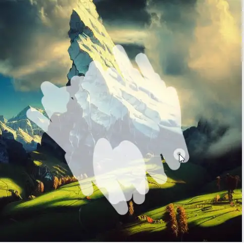{width=484 height=482 loading=lazy} | 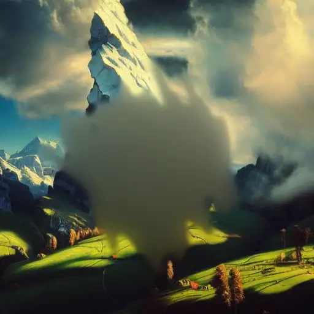{width=512 height=512 loading=lazy} | 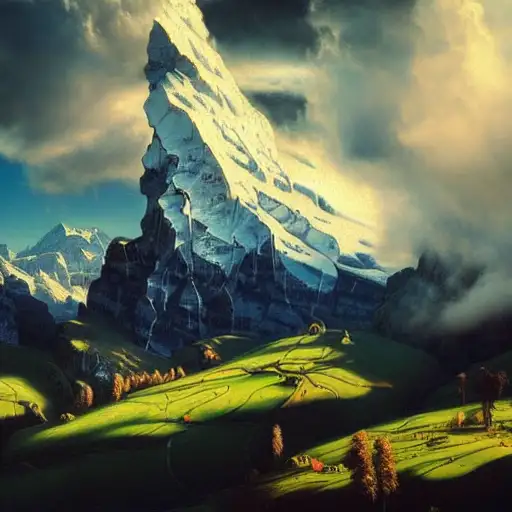{width=512 height=512 loading=lazy} | 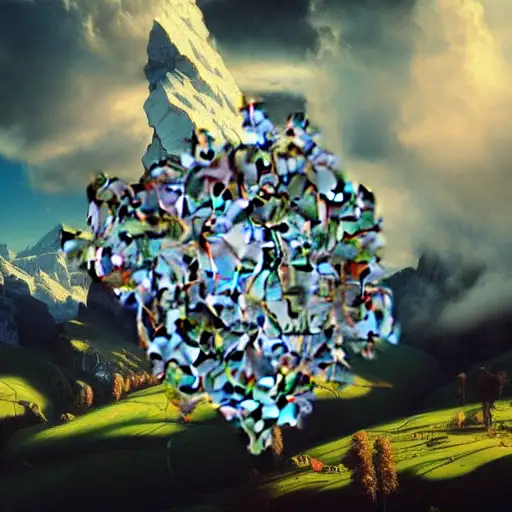{width=512 height=512 loading=lazy} | 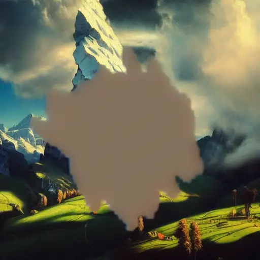{width=512 height=512 loading=lazy} |

`mask` 横条决定了涂抹区块边缘的平滑程度。original 指代 `原图`，fill 是 `填充底色`。

::: tip
`fill` 要更多 step 才能消除不自然感.
:::

`mask` 横条决定了模糊程度。original 是`原图`，fill 是`填充底色`，`fill` 要更多 step 才能消除不自然感。

`Inpaint at full resolution` 即全分辨率修复。默认情况下 Inpaint 会将生成的图像大小 **整体** 调整为 _UI 中指定的目标分辨率_。启用 `Inpaint at full resolution` 后，**仅调整遮罩区域** 的大小，并在处理后将其 **粘贴回** 原始图片。这允许你处理大尺寸图片，并允许以更大的分辨率渲染修复对象。

目前有几种方法进行重绘制操作：

-   在网络编辑器中自己绘制蒙版（`Inpaint masked `指重画涂鸦区域，`Inpaint not masked` 指重画涂鸦之外的区域）
-   在外部编辑器中擦除部分图片并上传透明图片。 透明区域会成为蒙版的一部分。注意：某些编辑器默认将完全透明的区域保存为黑色。
-   将模式（图片右下角）更改为 "Upload mask" 并为蒙版处理为单独的黑白图像(白色部分会被 inpaint)。

如果 `inpaint at full resolution` 出现黑块，可能是内存不足，尝试卸载 vae.

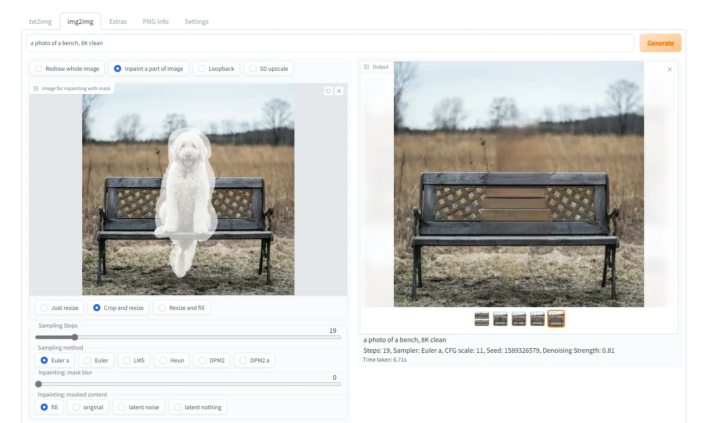{width=1597 height=957 loading=lazy}

[开源调研-AI 绘画全参数讲解-002img2img 图像到图像](https://www.bilibili.com/video/BV1HK411Q7uk)

通过这种方法，我们可以更改角色衣物风格或者其他任何细节。

[如何教会 AI 画手](https://www.bilibili.com/video/av559044202)

## Outpainting 外部修补

Outpainting 扩展原始图像并修复创建的空白空间。
您可以在底部的 img2img 选项卡中找到该功能，在 Script -> Poor man's outpainting 下。

> Outpainting, unlike normal image generation, seems to profit very much from large step count. A recipe for a good outpainting is a good prompt that matches the picture, sliders for denoising and CFG scale set to max, and step count of 50 to 100 with Euler ancestral or DPM2 ancestral samplers.

## Img2Img Loopback 回环生成

在 img2img 中设置 loopback 脚本，它允许自动将输出图像设为下一批的输入图像。

Batch 数设置控制获得多少次迭代

通常，在执行此操作时，您需要自己为下一次迭代选择许多图像中的一个，因此此功能的有用性可能值得怀疑，但反正我已经设法获得了一些我无法获得的非常好的输出。

## Img2Img 让低显存生成大分辨率图片

如果遇到生成鬼图或者低显存生产高分辨率图片，可以采用 Img2Img 画质提升脚本。

其实我**强烈推荐**你使用 Extras 的功能对低分辨率进行重放，效果不错的，且体验良好！

### 脚本

但是如果你想使用脚本提供的分辨率增强，这里有 Img2Img 的具体流程

1. 使用 `--medvram` 或者 `--lowvram` 参数启动 webui
2. 选择较小分辨率生成图片。记住你生成图片的分辨率。生成完毕之后，复制图片的 `Seed`
3. 生成完毕后，先查看图片效果是否满意。如果满意，直接将图片送进 Img2img。（点击 `Send to img2img`）
4. 在 img2img 界面底部，有一个 `Script` 选项。将 `Script` 选为 `SD Upscale`，里面的 Tile overlap 尽量调小
5. 一般送入 Img2img 的图，输入框自动填充原提示词。如果你发现 prompt 有变动，请手动填充
6. 选择合适的 `Sampling Steps` 和 `Sampling method`
7. 确认你的 `Width` 和 `Height` 与**原图**一致
8. 将第 2 步复制的 Seed 填入 img2img 的 Seed 里并生成

这里的 Width 和 Height 是超分时 img2img 的图片大小，如果不等会导致出现重叠问题

SD Upscale 选项在 Img2Img 的 Script 栏目中，主要作用是提升分辨率。

[脚本解决方案来源于此](https://gist.github.com/crosstyan/f912612f4c26e298feec4a2924c41d99#%E9%AB%98%E5%88%86%E8%BE%A8%E7%8E%87%E4%B8%8B%E5%87%BA%E6%80%AA%E5%9B%BE)

### 附加功能 Extras

SD-WebUI 的 Extras 页有一个自带的超分功能，可以使用 `ESRGAN_4x` 模型提升图片分辨率。

当然 `RealESRGAN` 或者 `RealCUGAN` 也可以。

::: tip 相关模型
文件统一下载到 `SDwebUI文件夹\models` 下

[LDSR](https://heibox.uni-heidelberg.de/f/578df07c8fc04ffbadf3/?dl=1)，文件大小为 1.9GB

[BSGRAN 4x](https://github.com/cszn/KAIR/releases/download/v1.0/BSRGAN.pth) ，文件大小为 63.9M

[ESRGAN_4x](https://github.com/cszn/KAIR/releases/download/v1.0/ESRGAN.pth)，文件大小为 63.8MB

[ScuNET GAN/PSNR](https://github.com/cszn/KAIR/releases/download/v1.0/scunet_color_real_gan.pth" to D:\stable-diffusio\models\ScuNET\ScuNET.pth)，文件大小为 68.6MB

[SwinIR 4x](https://github.com/JingyunLiang/SwinIR/releases/download/v0.0/003_realSR_BSRGAN_DFOWMFC_s64w8_SwinIR-L_x4_GAN.pth)，文件大小为 136MB
:::

**Highres Fix/超分应该使用什么 Upscaler？**

`SD Upscaler` 在注重细节的同时还提升分辨率。

曾经有段时间，`LSDR` 被认为是最好的。有些人喜欢 swinir，有些喜欢`esrgan4x`，`ymmv`，推荐使用 `ESRGAN_4x`

如果你要搞二次元，推荐使用[realcugan](https://github.com/bilibili/ailab/tree/main/Real-CUGAN)

## 图像去噪

推荐使用 [Real-ESRGAN](https://github.com/xinntao/Real-ESRGAN) 降噪。

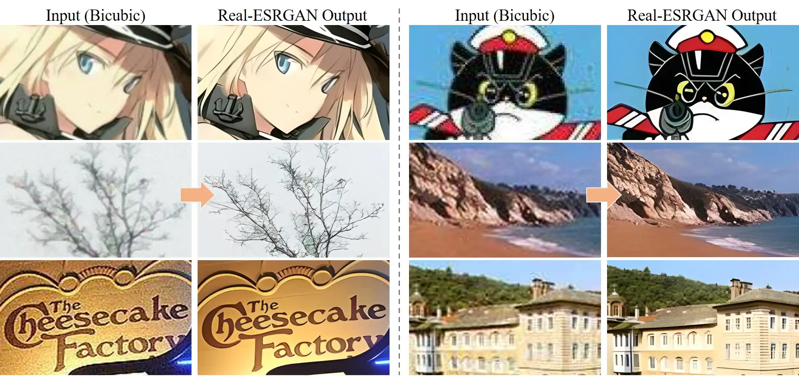{width=1844 height=870 loading=lazy}

> 效果图
