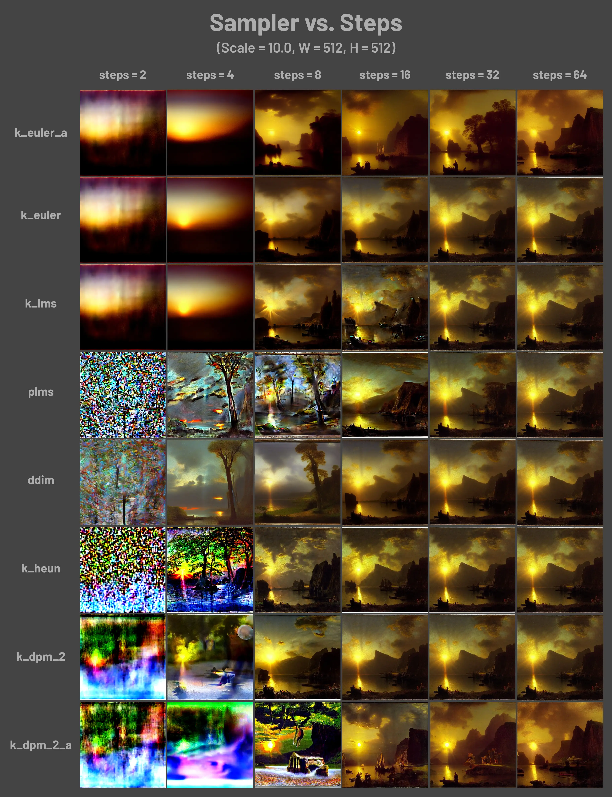
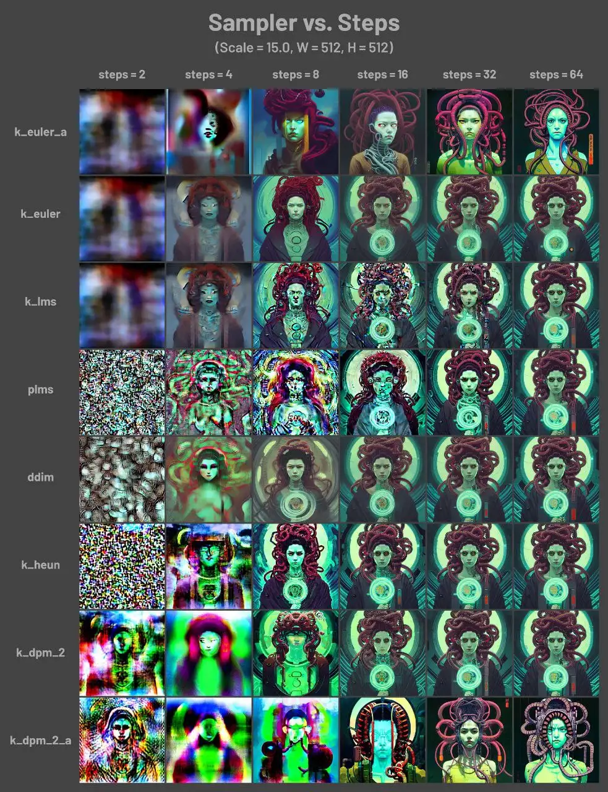

# 调参基础

本章内容大多基于 Stable Diffusion WebUI 前端。NovelAI 原始界面只开放了所有设置的一小部分。

## 参数介绍

来自 [installgentoo wiki](https://wiki.installgentoo.com/wiki/Stable_Diffusion)

-   Prompt：对你想要生成的东西进行文字描述。
-   Negative prompt：用文字描述你不希望在图像中出现的东西。
-   Sampling Steps：扩散模型的工作方式是从随机高斯噪声向符合提示的图像迈出小步。这样的步骤应该有多少个。更多的步骤意味着从噪声到图像的更小、更精确的步骤。增加这一点直接增加了生成图像所需的时间。回报递减，取决于采样器。
-   Sampling method：使用哪种采样器。Euler a（ancestral 的简称）以较少的步数产生很大的多样性，但很难做小的调整。随着步数的增加，非 ancestral 采样器都会产生基本相同的图像，如果你不确定的话，可以使用 LMS。
-   Batch count/n_iter：每次生成图像的组数。一次运行生成图像的数量为 Batch count \* Batch size。
-   Batch size：同时生成多少个图像。增加这个值可以提高性能，但你也需要更多的 VRAM。图像总数是这个值乘以批次数。除 4090 等高级显卡以外通常保持为 1。
-   CFG Scale（无分类指导规模）：图像与你的提示的匹配程度。增加这个值将导致图像更接近你的提示（根据模型），但它也在一定程度上降低了图像质量。可以用更多的采样步骤来抵消。
-   Width：单个图像的宽度，像素。要增加这个值，你需要更多的 VRAM。大尺度的图像一致性（模型是在 512x512 的基础上训练的）会随着分辨率的提高而变差。非常小的值（例如 256 像素）也会降低图像质量。
-   Height：与宽度相同，但用于单个图像高度。
-   Seed：随机数的起点。保持这个值不变，可以多次生成相同（或几乎相同，如果启用了 xformers）的图像。没有什么种子天生就比其他的好，但如果你只是稍微改变你的输入参数，以前产生好结果的种子很可能仍然会产生好结果。

[一个小指南：RedditAbout](https://www.reddit.com/r/StableDiffusion/comments/xbeyw3/can_anyone_offer_a_little_guidance_on_the/)

## Step 迭代步数

::: info
迭代是重复反馈的动作，神经网络中我们希望通过迭代进行多次的训练以到达所需的目标或结果。
每一次迭代得到的结果都会被作为下一次迭代的初始值。
一个迭代 = 一个正向通过 + 一个反向通过
:::

更多的迭代步数可能会有更好的生成效果，更多细节和锐化，但是会导致生成时间变长。而在实际应用中，30 步和 50 步之间的差异几乎无法区分。

太多的迭代步数也可能适得其反，几乎不会有提高。

进行图生图的时候，正常情况下更弱的降噪强度需要更少的迭代步数(这是工作原理决定的)。你可以在设置里更改设置，让程序确切执行滑块指定的迭代步数。

## Samplers 采样器

目前好用的有 `Euler`，`Euler a`（更细腻），和 `DDIM`。

推荐 `Euler a` 和 `DDIM`，**新手推荐使用 `Euler a`**

`Euler a` 富有创造力，不同步数可以生产出不同的图片。

PS：调太高步数 (>30) 效果不会更好

`DDIM` 收敛快，但效率相对较低，因为需要很多 step 才能获得好的结果，**适合在重绘时候使用**

`LMS` 和 `PLMS` 是 `Euler` 的衍生，它们使用一种相关但稍有不同的方法（平均过去的几个步骤以提高准确性）。大概 30 step 可以得到稳定结果

`PLMS` 是一种有效的 LMS（经典方法），可以更好地处理神经网络结构中的奇异性

`DPM2` 是一种神奇的方法，它旨在改进 DDIM，减少步骤以获得良好的结果。它需要每一步运行两次去噪，它的速度大约是 DDIM 的两倍。但是如果你在进行调试提示词的实验，这个采样器效果不怎么样

`Euler` 是最简单的，因此也是最快的之一

[英文 Wiki 介绍](https://github.com/AUTOMATIC1111/stable-diffusion-webui/wiki/Features#attentionemphasis)

[英文论坛介绍](https://www.reddit.com/r/StableDiffusion/comments/xbeyw3/can_anyone_offer_a_little_guidance_on_the/)

-   举个例子

不同 Step 和 采样器 的不同效果：

| 预览一                                        | 预览二                                        |
| --------------------------------------------- | --------------------------------------------- |
|  |  |

## 注意尺寸

出图尺寸太宽时，图中可能会出现多个主体。

要匹配好姿势，镜头和人物才不畸形，有时候需要限定量词，多人物时要处理空间关系和 prompt 遮挡优先级。人数->人物样貌->环境样式->人物状态

1024 之上的尺寸可能会出现不理想的结果！推荐使用 小尺寸 + 适量提高 Step 步数 + 图片超分辨率。

## Highres. fix 高清修复

通过勾选 txt2img 页面上的 "Highres.fix" 复选框来启用。

默认情况下，txt2img 在非常高的分辨率下做出非常混沌的图像。而此插件这使得它可以避免使用小图片的构图，在较低的分辨率下部分渲染你的图片，提高分辨率，然后在高分辨率下添加细节。

## 种子调试

理论上，种子决定模型在生成图片时涉及的所有随机性。

实际的种子整数并不重要。它只是初始化一个定义扩散起点的随机初始值。

在不使用 xformers 等会带来干扰的加速器并应用完全相同参数（如 Step、CFG、Seed、prompts）的情况下，生产的图片应当完全相同。

不同显卡由于微架构不同，可能会造成预料之外的不同结果。主要体现在 GTX 10xx 系列显卡上。详见 [这里的讨论](https://github.com/AUTOMATIC1111/stable-diffusion-webui/discussions/2017#discussioncomment-3873467)。

## ckpt 文件安全问题

见 [It's not a virus it's a checkpoint file](https://huggingface.co/Deltaadams/Hentai-Diffusion/discussions/12)

ckpt 文件被加载时基本上可以执行任何内容，盲目加载有安全风险。请检查来源是否可靠再加载。

如果杀毒软件拦截，有可能创建者向文件中注入了恶意的 Python 代码。

可以通过此脚本检查风险：<https://rentry.org/safeunpickle2>

## 使用 WebUI 复现 NAI 官网结果

[相关讨论，应该读一读！](https://github.com/AUTOMATIC1111/stable-diffusion-webui/discussions/2017)

::: tip
由于 xformers 在优化过程中引入的抖动与部分显卡微架构差异，尝试完全复原在不同机器上生成的图片是不明智的。所以不要纠结一些细节不能复现。
:::

### 需要做的事情

-   如果使用 7G 模型，需要将 config.yml 改名为 `模型名.yml` 与模型文件放置在一起。这种加载方式可能消耗大量显存。如果使用 4G 模型，无需进行任何操作即可达到等同效果。
-   启用 xformers
-   加载 `animevae.pt` 模型（将该模型文件改名为 `模型名.vae.pt` 与模型文件放置在一起）
-   Settings 中将 `Stop At last layers of CLIP model` 设为 `2`
    -   匹配 NAI 的一个[优化](https://blog.novelai.net/novelai-improvements-on-stable-diffusion-e10d38db82ac)。
-   `Eta noise seed delta` 设置为 `31337`
-   使用 NovelAI 自动填充的正反标签
    -   正向标签：`masterpiece, best quality`
    -   反向标签：`lowres, bad anatomy, bad hands, text, error, missing fingers, extra digit, fewer digits, cropped, worst quality, low quality, normal quality, jpeg artifacts, signature, watermark, username, blurry`
-   如果使用大括号，将大括号翻译为权重数字（每个大括号 105%）

### 不需要做的事情

-   hypernetwork。官网默认并不使用 hypernetwork。
