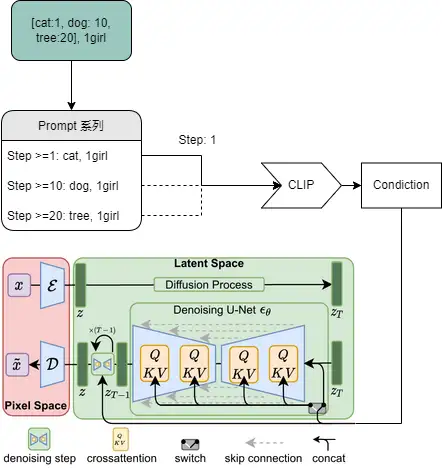

# 术语解释

## 损失函数

损失函数（loss function）或代价函数（cost function）是将随机事件或其有关随机变量的取值映射为非负实数以表示该随机事件的“风险”或“损失”的函数。 在应用中，损失函数通常作为学习准则与优化问题相联系，即通过最小化损失函数求解和评估模型。

关于 [损失函数](https://fangkaipeng.com/?p=2056#header-id-16) ([Archive](https://web.archive.org/web/20221102081512/https://fangkaipeng.com/?p=2056))

## 潜在空间

压缩数据的表示，其中相似的数据点在空间上更靠近在一起。

## 黑话

| 缩写             | 解释                                                                                                                                                     |
| ---------------- | -------------------------------------------------------------------------------------------------------------------------------------------------------- |
| NAI              | (NovelAI ，一般特指泄露模型)                                                                                                                             |
| 咒语/念咒        | 提示词组合 (prompts)                                                                                                                                     |
| 施法/吟唱/t2i    | 文本转图像 (txt2img)                                                                                                                                     |
| i2i              | 图像转图像 (img2img)                                                                                                                                     |
| 魔杖             | 图像生成所涉及到的参数                                                                                                                                   |
| inpaint/outpaint | 局部重绘，一种 img2img 的方法                                                                                                                            |
| ti/emb/嵌入模型  | 模型微调方法中的 Textual Inversion，一般特指 Embedding 插件                                                                                              |
| hn/hyper         | 模型微调方法中的 hypernetwork，超网络                                                                                                                    |
| 炸炉             | 指训练过程中过度拟合，但炸炉前的日志插件可以提取二次训练                                                                                                 |
| 废丹             | 指完全没有训练成功                                                                                                                                       |
| 美学/ext         | Aesthetic Embeddings，一种嵌入模型，特性是训练飞快，但在生产图片时实时计算。                                                                             |
| db/梦展          | DreamBooth，目前一种性价比高（可以在极少步数内完成训练）的微调方式，但硬件要求过高                                                                       |
| ds               | DeepSpeed，微软开发的训练方式，移动不需要的组件到内存来降低显存占用，可使 db 的 vram 需求降到 8g 以下。开发时未考虑 win，目前在 win 有兼容性问题故不可用 |
| 8bit/bsb         | 一般指 Bitsandbyte，一种 8 比特算法，能极大降低 vram 占用，使 16g 可用于训练 db。由于链接库问题，目前/预计未来在 win 不可用                              |

## ENSD

在设置页中的 `eta noise seed delta` 是 eta 噪声种子增量。

它对处理你种子的操作增加了一些偏移量。

NovelAI 官方在此处使用 `31337`。

## CLIP

> CLIP is a very advanced neural network that transforms your prompt text into a numerical representation. Neural networks work very well with this numerical representation and that's why devs of SD chose CLIP as one of 3 models involved in stable diffusion's method of producing images. As CLIP is a neural network, it means that it has a lot of layers. Your prompt is digitized in a simple way, and then fed through layers. You get numerical representation of the prompt after the 1st layer, you feed that into the second layer, you feed the result of that into third, etc, until you get to the last layer, and that's the output of CLIP that is used in stable diffusion. This is the slider value of 1. But you can stop early, and use the output of the next to last layer - that's slider value of 2. The earlier you stop, the less layers of neural network have worked on the prompt.  
> <br> > *https://github.com/AUTOMATIC1111/stable-diffusion-webui/wiki/Features#ignore-last-layers-of-clip-model*

要让 AI 作画，先要让程序“听懂”你的指令，比如

```text
a big cherry tree above a lake with flying petals in the sky.
```

对一个相对复杂场景的文本描述，AI 需要能“理解”并匹配到对应的画面，大部分项目依赖的都是一个叫 CLIP 的模型。

CLIP 在生成模型的潜在空间进行搜索，从而找到与给定的文字描述相匹配的潜在图像。

它非常现代且高效。

## CUDA

配合 CUDA 技术，显卡可以模拟成一颗 PhysX 物理加速芯片。目前，全系列的 GeForce 8 显示核心都支持 CUDA。

使用 CUDA 技术，GPU 可以用来进行通用处理（不仅仅是图形）；这种方法被称为 GPGPU。与 CPU 不同的是，GPU 以较慢速度并发大量线程，而非快速执行单一线程。以 GeForce 8800 GTX 为例，其核心拥有 128 个内处理器。利用 CUDA 技术，就可以将那些内处理器做为线程处理器，以解决数据密集的计算。

## LDM

Latent Diffusion Model 潜在扩散模型。



> 下面的框

[潜在扩散模型](https://zhuanlan.zhihu.com/p/573984443)

# VAE

VAE 作为一个生成模型，其基本思路是把一堆真实样本通过编码器网络变换成一个理想的数据分布，然后这个数据分布再传递给一个解码器网络，得到一堆生成样本，生成样本与真实样本足够接近的话，就训练出了一个自编码器模型。那 VAE (变分自编码器)就是在自编码器模型上做进一步变分处理，使得编码器的输出结果能对应到目标分布的均值和方差。

详见 [变分自编码器](http://www.gwylab.com/note-vae.html) ([Archive](https://web.archive.org/web/20221120160430/http://www.gwylab.com/note-vae.html))

