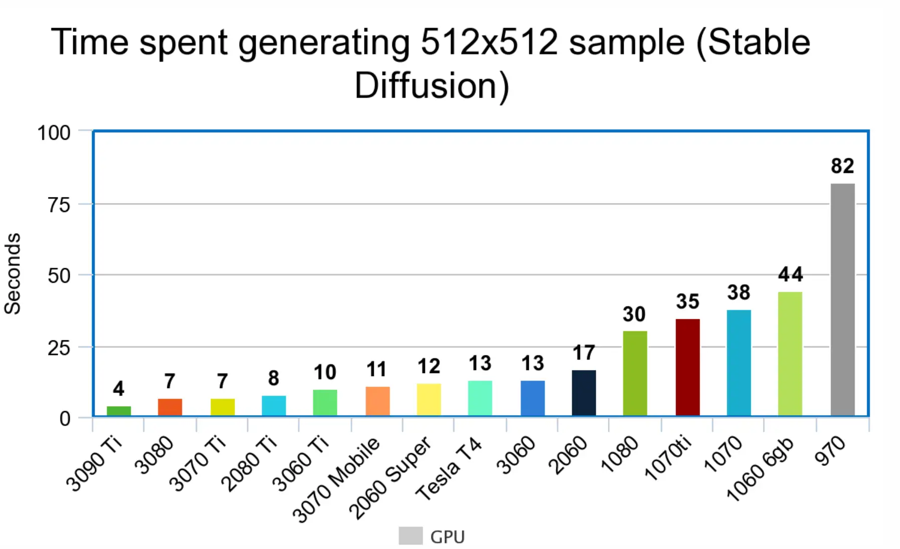

# SD-WebUI 安装方案

此教程参考了 [crosstyan 的 FAQ](https://gist.github.com/crosstyan/f912612f4c26e298feec4a2924c41d99)

WebUI 的官方代码仓库地址为 https://github.com/AUTOMATIC1111/stable-diffusion-webui

[官方英文安装教程](https://github.com/AUTOMATIC1111/stable-diffusion-webui#installation-and-running)

[官方给定的依赖列表](https://github.com/AUTOMATIC1111/stable-diffusion-webui/wiki/Dependencies)

## 硬件要求

最低需要显存 2 GB，建议显存不少于 4 GB。

在开始前，打开 CMD，输入

```cmd
nvidia-smi
```

查看机器的英伟达显卡是否正常运作。

{width=1794 height=1095 loading=lazy}

> 这里是 9 月份效果(现在快了不少)

## 安装

::: tip
推荐有能力的同学阅读一下 [官方 Wiki](https://github.com/AUTOMATIC1111/stable-diffusion-webui/wiki) 的内容。

注意！运行 AI 项目有很大的硬盘需求，请做好心理准备。总计依赖大小约几 G，在中国网络环境下可能很慢！

对于 Windows，**所有依赖均默认安装在 C 盘**，请确保空间充足。

不推荐使用 整合包，会导致升级困难。

WSL 不可以迁移，如果 C 盘不够，寄！
:::

### Windows 全新安装

在 Windows 上的安装流程如下。

<!-- TODO: 不如用 Anaconda -->

#### 安装 Python

安装 [Python 3.10](https://www.python.org/downloads/windows/)，安装时须选中 `Add Python to PATH`

> 部分整合包自带 Python 运行时。

<!-- TODO: 当心 Windows Store 坑 -->

::: tip 切换国内下载镜像

如果你在安装依赖时遇到了网络问题，需要按照 [设置 Pip 镜像](#pip-设置镜像) 中所述步骤切换至国内镜像。

:::

#### 安装 Git

在 [Git-SCM](https://git-scm.com/download/win) 下载 Git 安装包并安装。

#### 拉取仓库

打开命令提示符，并切换到合适的存放位置。

在命令框中运行

```cmd
git clone https://github.com/AUTOMATIC1111/stable-diffusion-webui.git
```

拉取仓库，这里如果如果失败请设置代理。

使用 Git 下载的源代码，可以直接使用 `git pull` 更新代码。推荐经常更新，并关注社区讨论。

如果是整合或者其他，请向上游（谁分发的）索取。

::: tip

关于如何设置 Git 代理，见 [Git 设置代理](#git-设置代理)。

:::

#### 装配模型并下载依赖

将 NAI 4G、 7G 或 其他模型的 `model.ckpt` 适当改名后放置在 `models/Stable-diffusion` 目录中，即可在页面顶部选择模型。

<!-- TODO: 这个没什么用？真不如 Waifu2x -->

（可选）将 `GFPGANv1.4.pth` 放在基本目录中，旁边是 `webui.py`

先确认你的显卡是可用的(见上文)，然后双击运行 `webui-user.bat` 。脚本会自动下载依赖（**一般需要 22 分钟，默认安装在 C 盘 Python 目录下，下载的资源为 1.98GB，解压后大小 2GB 以上**）并输出 启动网页界面 的地址。

在此期间你可以打开资源管理器，关注网络速度。在没有完成下载之前，脚本不会继续输出任何提示。(等了两小时？可以试试挂代理)

大约 30 分钟后安装完毕，程序会输出一个类似 `http://127.0.0.1:7860/` 的地址，点开即可(注意是 http，且不指定端口的话可能会变动)。

:::tip 运行需要模型！

如果你是瞄准二次元来的，请想办法搞到某个模型咯，至于模型选哪个，请看下一章节。如果你是整合包，也可以移植整合包其中的 `models` 文件夹。（甚至你可以直接去下载拆分整合包....？但是直接使用整合包迟早要走自己安装的流程，因为不能更新）

如果对其他模型感兴趣，（没错就是艺术，大概是梵高那类的）这里提供一个模型网站 [Stable Diffusion Models](https://rentry.org/sdmodels#)，可以通过下载 `2.Stable Diffusion v1.4 [4af45990] [7460a6fa] [06c50424]` 这一个模型来运行 `Stable Diffusion` 的原始模型
:::

### Windows 从整合包迁移

1. 使用

```cmd
git clone https://github.com/AUTOMATIC1111/stable-diffusion-webui.git
```

拉取代码到合适位置。

2. 将整合包中所有 Bat 文件，与 `models`、`outputs` 以及 `embeddings` 文件夹复制到新目录下。自行处理冲突。

3. 在新目录下，尝试运行原来的 Bat，如果报错，就根据提示排查是不是 NotFound 什么依赖，或者根据下面的命令说明修改 Bat 文件。

其他方法见 [懒人包改 Git 仓库进行更新](https://gist.github.com/crosstyan/f912612f4c26e298feec4a2924c41d99#%E6%87%92%E4%BA%BA%E5%8C%85%E6%94%B9-git-%E4%BB%93%E5%BA%93%E8%BF%9B%E8%A1%8C%E6%9B%B4%E6%96%B0)

### Linux 全新安装

安装依赖：

```bash
# Debian-based:
sudo apt install wget git python3 python3-venv
# Red Hat-based:
sudo dnf install wget git python3
# Arch-based:
sudo pacman -S wget git python3
```

加载脚本：

```bash
bash <(wget -qO- https://raw.githubusercontent.com/AUTOMATIC1111/stable-diffusion-webui/master/webui.sh)
```

完毕。

::: info
如果可以，尽量使用 `miniconda` （anaconda 特别巨大....），创建一个 Python 3.10.6 的虚拟环境。

```bash
conda create -n aidraw python=3.10.6

conda activate aidraw

COMMANDLINE_ARGS="--medvram" REQS_FILE="requirements.txt" python launch.py
```

:::

## 更新

使用 Git 下载的源代码，可以直接使用 `git pull` 更新代码。推荐经常更新，并关注社区讨论。

如果是整合或者其他，请向上游（谁分发的）索取。

## 启动

首先运行前必须加载一个任意模型。界面顶部的菜单可用于选择模型。

如果你运行报错，请读最后的自救提示。

不提供 NV 模型，你可以去 关于/底部图标 页面找到 `中文社区` 的频道，里面应该有你想要的哈。

### 载入模型后

Win 用户编辑并运行 `webui.bat`

Linux 用户可运行 `launch.py` 或 `webui.py` ，前者会自动安装(新)环境。

```bash
python launch.py
```

```
python web.py
```

### 令牌参数生成第一幅图片

咳咳，这里使用的是某个模型，示例仅仅适用于 `那个模型`。

令牌请读后面的内容，这里给出一个实例来供你完成测试。

- 第一个输入框里写关于期望结果的词汇

可以使用 颜文字 和 emoji，使用 () 来增强权重，具体规则见后

```
((masterpiece)), best quality, illustration, 1 girl, beautiful,beautiful detailed sky, catgirl,beautiful detailed water, cinematic lighting, dramatic angle, Grey T-Shirt, (few clothes),(yuri),(medium breasts),white hair,cat ears,masturbation,bare shoulders ,(gold eyes),wet clothes
```

- 第二个输入框书写不希望出现的结果

指定需要过滤什么标签

```
lowres, bad anatomy, bad hands, text, error, missing fingers, extra digit, fewer digits, cropped, worst quality, low quality, normal quality, jpeg artifacts, signature, watermark, username, blurry, bad feet
```

#### 第一次调整参数

选定分辨率参数。分辨率越大，生成耗时越长、耗费显存越大。通常不建议超过 1280 x 1280。

生成完成后的参数描述信息类似如下：

```text
Steps: 28, Sampler: Euler a, CFG scale: 7, Seed: 2706937631, Size: 1024x512, Model hash: 925997e9
```

通过一样的参数和 Seed (-1 就是随机)，可以生产一样的图像，这用于微调！

还有资源占用信息：

```text
Time taken: 33.97s
Torch active/reserved: 1975/2144 MiB, Sys VRAM: 7890/8134 MiB (93.61%)
```

#### 快捷设置

不想来回设置 Clip？

添加 `sd_hypernetwork` 和 `CLIP_stop_at_last_layers` 到设置页面的 `Quicksettings list`，保存并重新启动 webui，你就可以在 UI 顶部看到相应的快速切换选项啦～

::: tip 需要添加更多快捷设置?

有 Python 代码阅读能力的话则可在 [此处](https://github.com/AUTOMATIC1111/stable-diffusion-webui/blob/master/modules/shared.py) 源码中找到各设置定义的名称。

它们通常以将对象 `OptionInfo` 的实例作为值的字典的键存在。

:::

### 中文/本地化

当前，语言文件有两种分发途径：
1. 通过[插件](../../advanced/development/extensions.md)机制分发。插件 `localizations` 目录中的语言文件将应用到系统中。同名语言文件会 **互相覆盖**。
2. 作为单个 `.json` 文件提供。 将此文件放入 `localizations` 目录并在设置中选择即可。

#### 创建本地化文件

转到设置并单击 `Download localization template` 底部的按钮，下载一个可以编辑的本地化模板。

### 实例共享

#### 托管分享页

通过添加 `--share` 开关即可使用 Gradio 托管的转发服务。

你会得到一个 `https://xxx.gradio.app` 链接，这是在协作中使用该程序的预期方式。

::: danger RCE 警告

使用 `--share` 公开实例时，请务必设置账号密码身份验证：`--gradio-auth username:password` (可选择提供多组用户名和密码，以逗号分隔)

示例：

```text
--share --gradio-auth admin:admin,user1:user_password
```

使用该例子将会创建两个用户，一个是账号密码为 `admin` 的用户，另外一个是账号为 `user1`，密码为 `user_password` 的用户

如果攻击者可以访问 UI，他们可能能够远程运行 python 脚本。

10/30 社区报告：有人在扫描公开的 WebUI

11/1 社区反映：共享链接可能会导致安全风险，**攻击者可以访问系统上的所有文件。**
:::

可以通过添加 `--freeze-settings` 启动参数来锁定设置，防止他人编辑。

#### 端口转发

参数 `--listen` 使服务器监听外部网络连接。

这将允许本地网络上的其他计算机访问 UI，如果配置端口转发，公网上的计算机也可以访问（当然你得有公网）。

注意，监听 `0.0.0.0` 意味着对本地网卡所有 IPv4 监听，局域网访问请使用对应 IP 地址。

使用 `--listen` 会启用默认的安全保护设置，插件功能会失效，需要使用 `--enable-insecure-extension-access` 开启。

#### 修改监听端口

参数 `--port xxxx` 使服务器监听特定端口。

对于 Linux 系统，如需监听低于 `1024` 的任何端口，程序需要以 `root` 权限运行或授权 `CAP_NET_BIND_SERVICE` 能力，因此建议使用高于 `1024` 的端口。

默认端口为 `7860`。

### 自定义运行

进一步熟悉这个程序，你会发现可以通过修改 Bat 运行脚本添加参数！具体参数列表请读下文。

生成时报错？请读 [配置与调试](../configuration/param-basic.md) 章节。

首先，你可以运行 `python webui.py --help` 查看所有命令参数，或者在[源码文件](https://github.com/AUTOMATIC1111/stable-diffusion-webui/blob/master/modules/shared.py)中读到它们。

::: tip
自定义程序运行方式的推荐方法是编辑 `webui-user.bat` (Windows) 和 `webui-user.sh` (Linux)
:::

#### 环境定制

```cmd
set PYTHON=E:/soft/Python310/Python.exe
```

```bash
export PYTHON="/usr/local/python310/bin/python"
```

`set PYTHON` (Windows) 或 `export PYTHON` (Linux) 允许设置自定义 Python 路径。

```cmd
set VENV_DIR=C:\run\var\run
```

```bash
export VENV_DIR="/run/var/run"
```

`set VENV_DIR` (Windows) 或 `export VENV_DIR` (Linux) 可允许您选择虚拟环境的目录。默认为 `venv`。特殊值 `-` 在不创建虚拟环境的情况下运行脚本。

```cmd
set COMMANDLINE_ARGS=--ckpt a.ckpt
```

```bash
export COMMANDLINE_ARGS="--ckpt a.ckpt"
```

`set COMMANDLINE_ARGS` (Windows) 或 `export COMMANDLINE_ARGS` (Linux) 可设置运行 webui.py 的命令行参数。

示例中，设置使用模型 `a.ckpt` 而不是 `model.ckpt`

#### GPU 指定

选择要使用的默认 GPU `--device-id 0`，来代替旧版本 (2022/10 之前) 的 `CUDA_VISIBLE_DEVICES=0`，可以选择第二个 GPU 允许同时运行两个实例，从而能够以更简洁的方式简单地选择设备。

查看 GPU 序号，可以使用

```bash
nvidia-smi
```

#### 优化命令参数

来自 [官方 Wiki](https://github.com/AUTOMATIC1111/stable-diffusion-webui/wiki/Optimizations)

| 命令行参数                      | 解释                                                                                                                                                                                                                                                                        |
| ------------------------------- | --------------------------------------------------------------------------------------------------------------------------------------------------------------------------------------------------------------------------------------------------------------------------- |
| `--xformers`                    | 使用[xformers](https://github.com/facebookresearch/xformers)库。极大地改善了内存消耗和速度。Windows 版本安装由[C43H66N12O12S2 维护](https://github.com/C43H66N12O12S2/stable-diffusion-webui/releases)的二进制文件                                                          |
| `--force-enable-xformers`       | 无论程序是否认为您可以运行它，都启用 xformers。不要报告运行时错误。                                                                                                                                                                                                     |
| `--opt-split-attention`         | Cross attention layer optimization 优化显着减少了内存使用，几乎没有成本（一些报告改进了性能）。黑魔法。默认情况下`torch.cuda`，包括 NVIDIA 和 AMD 卡。（新版默认开启）                                                                                                                      |
| `--disable-opt-split-attention` | 禁用上述优化                                                                                                                                                                                                                                                              |
| `--opt-split-attention-v1`      | 使用上述优化的旧版本，它不会占用大量内存（它将使用更少的 VRAM，但会限制您可以制作的最大图片大小）。                                                                                                                                                                         |
| `--medvram`                     | 通过将稳定扩散模型分为三部分，使其消耗更少的 VRAM，即 cond（用于将文本转换为数字表示）、first_stage（用于将图片转换为潜在空间并返回）和 unet（用于潜在空间的实际去噪），并使其始终只有一个在 VRAM 中，将其他部分发送到 CPU RAM。降低性能，但只会降低一点-除非启用实时预览。 |
| `--lowvram`                     | 对上面更彻底的优化，将 unet 拆分成多个模块，VRAM 中只保留一个模块，破坏性能                                                                                                                                                                                                  |
| `*do-not-batch-cond-uncond`     | 防止在采样过程中对正面和负面提示进行批处理，这基本上可以让您以 0.5 批量大小运行，从而节省大量内存。降低性能。不是命令行选项，而是使用`--medvram`or 隐式启用的优化`--lowvram`。                                                                                              |
| `--always-batch-cond-uncond`    | 禁用上述优化。只有与`--medvram`或`--lowvram`一起使用才有意义                                                                                                                                                                                                                |
| `--opt-channelslast`            | 更改 torch 内存类型，以稳定扩散到最后一个通道，效果没有仔细研究。                                                                                                                                                                                                            |

[讨论](https://github.com/AUTOMATIC1111/stable-diffusion-webui/discussions/3889) 中有人认为，通过在 Windows 设置上禁用硬件加速 GPU 调度，WebUI 性能提高了大约 10-50%

#### 主题

添加 `--theme` 参数来切换主题。

#### API

见 [API](../../advanced/development/api.md)。

## 错误处理 Troubleshooting

这里是一些关于设置不当引发的异常。

翻译整理自 [Voldy 的傻瓜教程](https://rentry.co/voldy)

### 路径含有空格

路径不允许含有空格，确保您的文件夹路径没有空格。该程序经过测试可在 Python 3.10.6 上运行，低版本 Python 可能会发生错误。

重新安装，请删除目录：`venv`, `repositories`。

### 网络问题

如果安装过程中出现：

- 形如 `Connection timed out` 字样
- 形如 `Connection was Reset` 字样
- 下载速度极慢

请设置代理，或者使用 VPN。

#### Git 设置代理

如果你本地开启了代理，可以使用如下命令设置：

```bash
git config --global http.proxy <代理地址>
git config --global https.proxy <代理地址>
```

使用结束后建议及时恢复，以免产生其他问题。

```bash
git config --global --unset http.proxy
git config --global --unset https.proxy
```

如果你不会设置代理，可以使用以下命令拉取镜像：

<!-- 自营镜像 -->

```cmd
git clone https://jihulab.com/hunter0725/stable-diffusion-webui.git
```

或

```cmd
git clone https://hub.fastgit.xyz/AUTOMATIC1111/stable-diffusion-webui.git
```

#### Pip 设置镜像

打开 CMD 命令行（Win+R 运行 cmd），输入 `python` 回车，检查是否正确安装 Python 环境。如果能成功进入 Python，按下 Ctrl+Z (或输入 `exit()` 回车) 退出。

然后输入以下命令设置镜像。

<!-- 清华有点慢。清华人建议用 BFSU，比较快 -->

```cmd
pip config set global.index-url https://mirrors.bfsu.edu.cn/pypi/web/simple
```

### 长时间无反应

设镜像或者挂代理，**依赖项 >2GB**，请做好准备，而且对于 Windows，**依赖默认安装在 C 盘**！

### 显存不足/CUDA out of memory

<!-- opt-split-attention 已经是默认了。这里删掉这些。 -->

确保你拥有可以运行的最新 CUDA 工具包和 GPU 驱动程序.

在具有少量显存 (&lt;=4GB) 的视频卡上运行时，可能会出现内存不足错误。可以通过命令行参数启用各种优化，牺牲一些速度来支持使用更少的 VRAM：

如果出现显存不足错误，请首先尝试 `--medvram`;

如果仍然出现显存不足错误，请改用 `--medvram --always-batch-cond-uncond`；

如果依旧出现显存不足错误，请尝试 `--lowvram`。注意这会让运行速度大幅降低。

如果还不行....

{width=1280 height=959 loading=lazy}

建议你升级设备。

### DefaultCPUAllocator...

内存不足。

考虑关闭软件、增加虚拟内存容量，或增加内存条。

### 我 Python 呢？

如果你的 Python 不在 `PATH` 中，可在文件夹中创建或修改 `webui.settings.bat` 添加行 `set PYTHON=<python 路径> ` 来说明 Python 可执行文件的完整路径（请看下面的参数说明！）

### ERROR:asyncio:Accept failed on a socket

先检查端口冲突，有没有和什么软件冲突。

这个错误有可能是 `Python38` 的 `asyncio` 库对 `Windows` 的兼容性问题。

如果曾经使用过 WSL，不妨试试

```cmd
net stop winnat
net start winnat
```

<!-- TODO: 重置 catalog 真的能解决么？ -->

如果使用过游戏加速器，可尝试用 CMD 管理员身份运行 `netsh winsock reset`。

如果仍然无法启动，请尝试 [更换一个端口](#修改监听端口)。

### 虚拟环境

如果你使用 conda 可以不使用一键脚本，自己运行 launch 安装依赖。

因为仓库给出的一键安装脚本会创建虚拟环境，然后启动 [launch.py](https://github.com/AUTOMATIC1111/stable-diffusion-webui/blob/master/launch.py)。

在运行时，一键安装程序会创建一个 python 虚拟环境，因此如果你在安装之前安装了一个模块，那么任何已安装的模块都不会影响你

如果需要防止创建虚拟环境而使用系统 python，编辑 `webui.bat` 替换 `set VENV_DIR=venv`为`set VENV_DIR=`

### api-ms-win-core-path-l1-1-0.dll is missing

Windows 7 上运行很可能会报错: `api-ms-win-core-path-l1-1-0.dll is missing`，这是因为许多程序需要新版本的 Windows 的系统文件。

如果没有出现该错误，不需要执行下面的操作。

这些文件已经被移植来与 Windows 7 兼容，并且可以在 [这里](https://github.com/nalexandru/api-ms-win-core-path-HACK/releases/download/0.3.1/api-ms-win-core-path-blender-0.3.1.zip) 下载。它的 [GitHub 页面](https://github.com/nalexandru/api-ms-win-core-path-HACK/)

解压缩并将 `x86.dll` 复制到 `C:\Windows\SysWOW64` ，将 `x64.dll` 复制到 `C:\Windows\System32` 并重启。

### an illegal memory access was encountered ....CUDA kernel errors...

[相关问题 Issue](https://github.com/AUTOMATIC1111/stable-diffusion-webui/issues/1766)

在多数情况下，这代表显存溢出，也有可能是 GPU 硬件问题。

据说使用 DeepDanbooru 的话会有这个提示，可以尝试重新启动 或 安装 CPU 版本的 DeepDanbooru.

### Cannot connect to proxy

代理设置问题，检查全局变量有无协议头（需要有），如果是 Clash，开启 TUN 模式即可。

如果没开代理，尝试更新到最新版本。

见 [#491](https://github.com/AUTOMATIC1111/stable-diffusion-webui/issues/491)。

### Failed to establish a new connection

在我的电脑 -> 右键 -> 属性 -> 环境变量中，删除代理环境变量（小心操作）

代理环境变量形如：

```text
HTTP_PROXY
HTTPS_PROXY
ALL_PROXY
```

等等。

见 [#2684](https://github.com/AUTOMATIC1111/stable-diffusion-webui/issues/2684)。

### safe.directory

```cmd
git config --global --add safe.directory "*"
```


