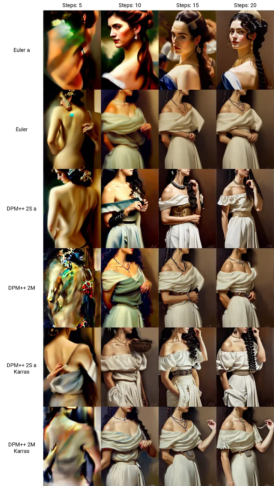
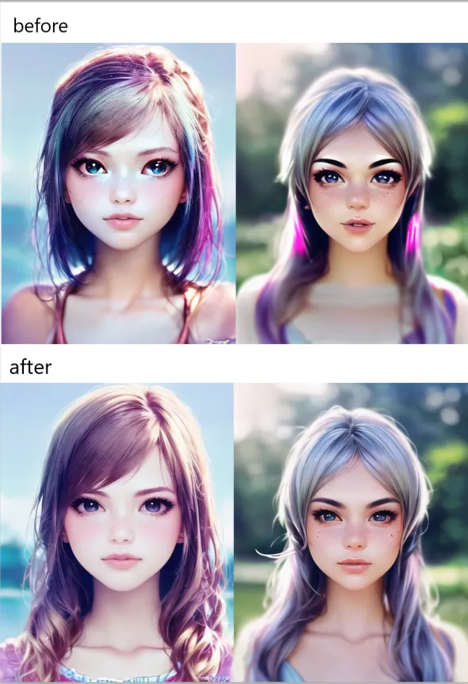
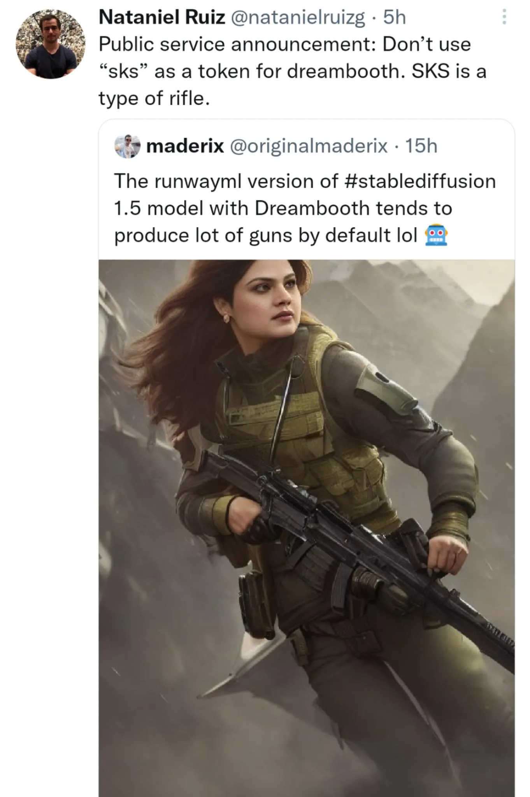
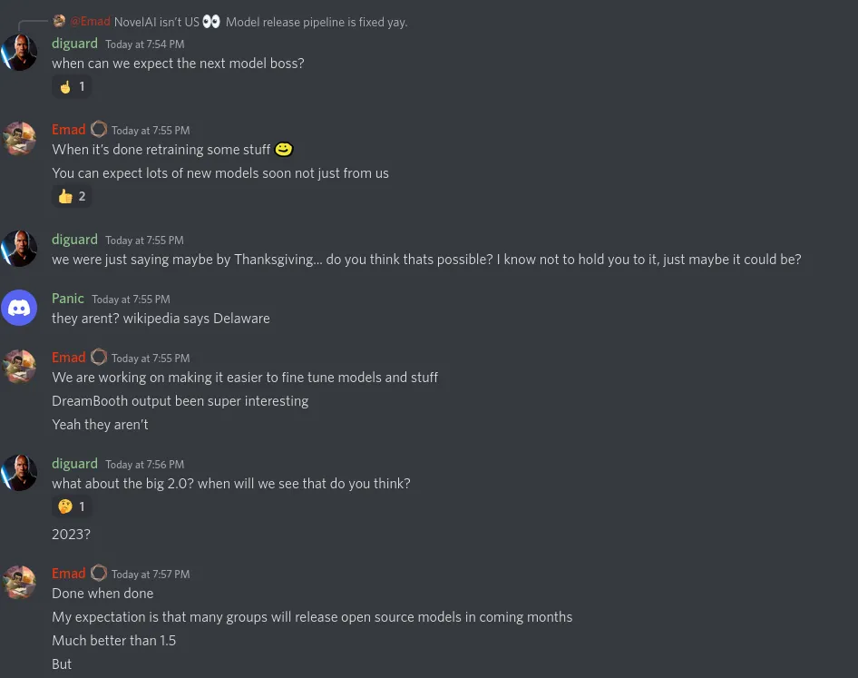
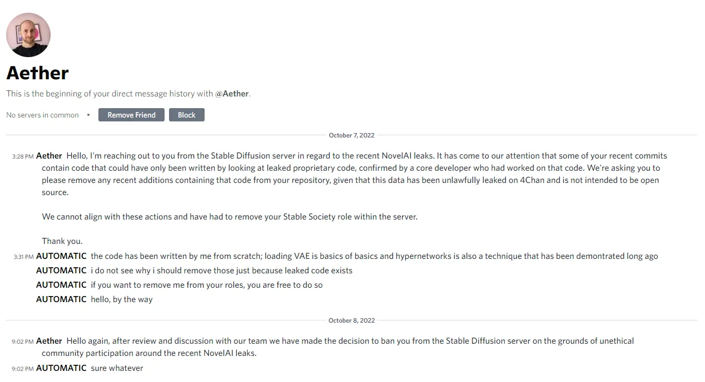
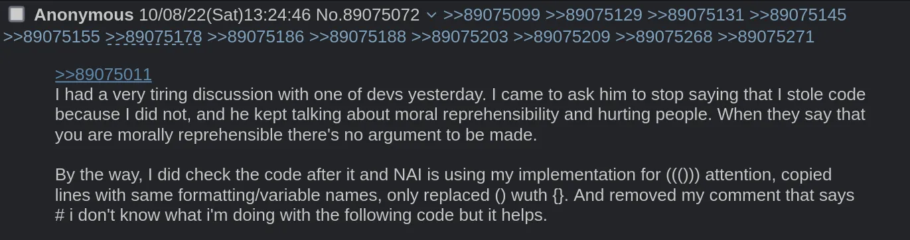

# 新闻

::: tip
目前 Stable Diffusion WebUI 迭代非常快，每天都会有大量更新，因此建议每天都拉取最新代码。
:::

以下是该领域的最新消息。

英文原版见 
 - [sdupdates @ rentry](https://rentry.org/sdupdates)
 - [sdupdates2 @ rentry](https://rentry.org/sdupdates2)
 - [sdupdates3 @ rentry](https://rentry.org/sdupdates3) 

## 11/22

- [梯度累积、autocast 修复、新的潜在采样方法等](https://github.com/AUTOMATIC1111/stable-diffusion-webui/pull/4886)

## 11/19 - 11/22
* 警惕 `sdupdates6` 可能是假的
* WebUI 中 Textual inversion 训练的实现有问题，它可以更高效: https://github.com/AUTOMATIC1111/stable-diffusion-webui/pull/4680
	* Pull Request: https://github.com/AUTOMATIC1111/stable-diffusion-webui/pull/4886
	* 与 Hypernetworks 相关的 PR: https://github.com/AUTOMATIC1111/stable-diffusion-webui/pull/4509
* 支持 safetensors 的 PR，比原先的 pt、ckpt 加载更快、更安全: https://github.com/AUTOMATIC1111/stable-diffusion-webui/pull/4930
	* 另一个: https://github.com/AUTOMATIC1111/stable-diffusion-webui/pull/4869
* HuggingFace 与 Pytorch 合作使得基于 transformers 的模型演算地更快 (4.5 倍的速度提升): https://twitter.com/huggingface/status/1594783600855158805
	* https://twitter.com/PyTorch/status/1594766050851102720
	* 文档: https://huggingface.co/docs/optimum/bettertransformer/overview
* SceneComposer：约翰霍普金斯大学和 Adobe 发布的基于语义的图像合成（可以指定某些提示词对应物体的位置）: https://zengyu.me/scenec/
	* 文本 -> 勾画物体在图片的位置，可以调整精度 -> 把东西画在你想让他出现的位置 -> 可以用更多遮罩来细化
	* 演示: https://zengyu.me/scenec/resources/demo_video.mp4
	* Git: https://github.com/zengxianyu/scenec
	* 论文: https://arxiv.org/abs/2211.11742
* Magic3D (文本转 3D) 由 NVIDIA 发布: https://deepimagination.cc/Magic3D/
	* 使用文本创建 3D 网格模型
* 纯 pytorch 的 deepdanbooru 实现发布: https://github.com/AUTOMATIC1111/TorchDeepDanbooru
	* AUTOMATIC1111 在考虑是从 webui 中删除 tensorflow 版本还是保留两者。他更喜欢前者。
* WebUI 检查提示词相似度的插件: https://gitlab.com/azamshato/simula
* CLIPSeg demo (使用文字修补): https://huggingface.co/spaces/nielsr/text-based-inpainting
	* 文字转遮罩 (当前 webui 插件): https://github.com/ThereforeGames/txt2mask
* (近期更新) Prompt travel: https://github.com/Kahsolt/stable-diffusion-webui-prompt-travel
* Accelerate 启动器实现: https://github.com/AUTOMATIC1111/stable-diffusion-webui/pull/4527
	* https://huggingface.co/docs/accelerate/index
* 自动发布 4chan: https://rentry.org/promptchan
* Anime NYK 与 Anime LA 封禁 AI 作品: https://www.artnews.com/art-news/news/anime-conventions-ban-ai-art-1234647165/
* Midjourney x Spellbrush https://nijijourney.com/ (midjourney 但是二次元)

## 11/19

* AUTOMATIC1111 webui 更新了，建议及时 `git pull`
	* 更新列表: https://github.com/AUTOMATIC1111/stable-diffusion-webui/commits/master
* (重发，修复图片) AltDiffusion 发布: https://huggingface.co/BAAI/AltDiffusion-m9
	* 支持多种语言：English(En), Chinese(Zh), Spanish(Es), French(Fr), Russian(Ru), Japanese(Ja), Korean(Ko), Arabic(Ar) and Italian(It)
	* 原始模型基于中文、英文: https://huggingface.co/BAAI/AltDiffusion
	* 完全开源
	* 由双语 CLIP 模型 AltCLIP 提供支持
	* 示例: https://i.4cdn.org/g/1668837915177041.png

## 11/18

- [逆向思维修复手](https://twitter.com/needle/status/1593428231901700101)

## 11/14 - 11/18

* 面向 CPU、GPU、加速器和异构集群的高性能机器学习和数据分析方法发布 (不确定安全性): https://github.com/nod-ai/SHARK
* Safetensors，一种安全的模型存储方式，比 Pytorch 自带的方式快很多: https://huggingface.co/docs/safetensors/speed
* CLIPSeg (基于文字的图片修补): https://huggingface.co/spaces/nielsr/text-based-inpainting
* 使用自然语言指令指令实现的图转图: https://www.timothybrooks.com/instruct-pix2pix
* 动态提示现在支持模板语言: https://github.com/adieyal/sd-dynamic-prompts/blob/main/jinja2.md
* Latent-NERF 发布，与 stable-dreamfusion 类似，可产生更多受约束的输出 (?): https://github.com/eladrich/latent-nerf
* 易于使用的本地安装 SD 版本发布：https://artroom.ai/download-app
	* 文档: https://docs.equilibriumai.com/artroom
	* GitHub: https://github.com/artmamedov/artroom-stable-diffusion
	* Discord: https://discord.com/invite/XNEmesgTFy
	* https://www.reddit.com/r/StableDiffusion/comments/yxdgps/easytouse_local_install_of_stable_diffusion/
	* 图片修补、扩充 (使用 runway 模型)，嵌入模型与超网络将在后期更新
* 从大脑到 Stable Diffusion: https://mind-vis.github.io/
* 通用科学语言模型 (可以编写代码等, https://i.4cdn.org/g/1668563334234815s.jpg) (完全开源): https://github.com/paperswithcode/galai
	* https://twitter.com/paperswithcode/status/1592546938473549824
	* 可以总结学术文献、解决数学问题、生成 Wiki 文章、编写科学代码、注释分子和蛋白质等等
	* "为了加速科学发展，我们开源了所有模型，包括无修正的 1200 亿模型。"
* 在 AUTOMATIC1111 的 webui 中一次加载多个超网络的脚本 (未测试): https://github.com/antis0007/sd-webui-multiple-hypernetworks
* WD 1.4 打标插件 (未测试): https://github.com/toriato/stable-diffusion-webui-wd14-tagger
* (添加了一些信息) 防 img2img 水印: https://github.com/MadryLab/photoguard
	* 示例笔记本（带图）: https://github.com/MadryLab/photoguard/blob/main/notebooks/demo_complex_attack_inpainting.ipynb
	* 有人报告说它不能很好地工作/仅适用于特定模型 + 引入杂物
	* 看起来相似：https://github.com/ShieldMnt/invisible-watermark
* 在 AUTOMATIC1111 发布的 webui 中直接搜索 danbooru 标签的扩展: https://github.com/stysmmaker/stable-diffusion-webui-booru-prompt
	* 支持帖子 id
	* 支持 Danbooru 的所有搜索语法
* 无失真合并 SD 模型 (第三方 git-re-basin 方法: https://github.com/samuela/git-re-basin): https://github.com/ogkalu2/Merge-Stable-Diffusion-models-without-distortion
* Facebook 发布快速 SD 方法: https://github.com/facebookincubator/AITemplate/tree/main/examples/05_stable_diffusion
	* 有人报告性能可达到 35.81 it/s on 3090, 512x512, 50 steps

## 11/15

- 关于 NAI Leak 的 Colab DMCA 通知
  - https://lumendatabase.org/notices/29484955
  - https://lumendatabase.org/notices/29484957

## 11/13 + 11/14

* 防 img2img 水印: https://github.com/MadryLab/photoguard
	* 看起来类似: https://github.com/ShieldMnt/invisible-watermark
* 自签名 TLS/HTTPS 扩展 (不确定是否会自动安装证书): https://github.com/papuSpartan/stable-diffusion-webui-auto-tls-https
* Stable Diffusion + production company 的酷炫示范 (?): https://www.youtube.com/watch?v=QBWVHCYZ_Zs
* (尚未实现) 使用技巧稳定 DPM Solver++ 2M 的采样: https://github.com/crowsonkb/k-diffusion/issues/43#issuecomment-1304916783
	* 需要做的修改: https://rentry.org/wf7pv
* 用于使用 Diffusers、Hivemind 和 Pytorch Lightning 训练稳定扩散模型的存储库发布了 (有人说他们的博客提到对 NAI 模型进行微调有正向效果): https://github.com/Mikubill/naifu-diffusion

## 11/11 + 11/12

* 中文开源 SD 模型发布: https://huggingface.co/IDEA-CCNL/Taiyi-Stable-Diffusion-1B-Chinese-v0.1
	* 让它与 AUTOMATIC1111 的 WebUI 一起工作（可能）: https://github.com/IDEA-CCNL/stable-diffusion-webui/commit/61ece0cec1097ab8f5e2b52c8d340ca203c5917b
* 提示词中的显式填充: https://github.com/AUTOMATIC1111/stable-diffusion-webui/pull/2642
	* 相关的，可能有助于写提示词: https://github.com/AUTOMATIC1111/stable-diffusion-webui/issues/2305
* DeviantArt 发布 AI 图像生成器: https://twitter.com/DeviantArt/status/1591113199218487300
	* 花钱买会员，可能不如 webui
	* 立马被削弱: https://www.deviantart.com/team/journal/UPDATE-All-Deviations-Are-Opted-Out-of-AI-Datasets-934500371
		* https://twitter.com/arvalis/status/1591242450055892992
* 使用 ColossalAI 训练 Stable Diffusion: https://github.com/hpcaitech/ColossalAI/tree/main/examples/images/diffusion
	* 6.5 倍训练速度，节省训练成本，微调的硬件成本可以便宜近 7 倍 (从 RTX3090/4090 24GB 到 RTX3050/2070 8GB)
* 对生成的面部图片动画化测试: https://www.reddit.com/r/StableDiffusion/comments/ys434h/animating_generated_face_test/
* Waifu Diffusion 1.4 标签工具 (下一版的 deepdanbooru?): https://mega.nz/file/ptA2jSSB#G4INKHQG2x2pGAVQBn-yd_U5dMgevGF8YYM9CR_R1SY
	* Waifu Diffusion 开发 (SD training labs 服务器): https://discord.com/channels/1038249716149928046/1038249717001359402/1041160494150594671
* DreamArtist 扩展改变了 `modules/ui.py` 的源码
	* 扩展: https://github.com/7eu7d7/DreamArtist-sd-webui-extension
	* 相关源码: https://github.com/7eu7d7/DreamArtist-sd-webui-extension/blob/9f65d05127a551e5dcf044ed6340510f3ba082f4/install.py#L15-L28
	* 破坏自身和正常的 Textual Inversion 模型，直到被修改的的所有文件都被原本替换
	* Webui 在关闭扩展后无法正常启动，由于添加的 'dream_artist_trigger'
	* 到目前为止，它不在 wiki 扩展列表中，必须通过 repo url 下载。 如果您想下载它，请自行承担风险。
	* 如要修复，执行 `git stash` 和 `git pull`
* 根据预览图像与学习数据的差异自动调整超网络学习率: https://github.com/AUTOMATIC1111/stable-diffusion-webui/pull/4509
* 用于解释 Stable Diffusion 的标签归因图 (又名标签热度图): https://github.com/castorini/daam
	* https://github.com/AUTOMATIC1111/stable-diffusion-webui/issues/4592
* DeepDanbooru 损坏 (未知是否修复): https://github.com/AUTOMATIC1111/stable-diffusion-webui/issues/4458
* macOS Finder 右键菜单扩展发布: https://github.com/anastasiuspernat/UnderPillow
* [Pull#4563](https://github.com/AUTOMATIC1111/stable-diffusion-webui/pull/4563) 在 ngrok 中添加用户名和密码

```
Allows specifying the user of ngrok by username and password using the : --ngrok authtoken:username:password
and keep old args for not using username and password only use authtoken : --ngrok authtoken
```

## 11/10

* Waifu Diffusion 1.4 信息:
	* 更准确的自动标签工具 Deepdanbooru (目前处于预发布状态)
	* 更好的手 - 未完成的例子见 'Cafe Unofficial Instagram TEST Model Release'
	* 根据 SD 1.5 训练
	* 创作者: "对于扩展性与灵活性而言，WD 1.4 应该做的比市面上其他模型都好" (计划替代目前的所有公开模型，包含 NovelAI 模型与 Anything，不再需要混合模型)
	* 创作者: "我们可能创建我们自己的超网络用于微调动漫或现实画风"
	* 创作者: Instagram 模型训练包含了如下改进:
		1. 动态图片长宽比（无剪裁）
		2. unconditional training 使得模型可以自我提升
		3. 更高的训练分辨率 (最高 640x640)
		4. 更快的训练代码 (6-8 倍性能提升)
		5. 所有图片自动 BLIP 打标
	* 数据集与标签都将公开
	* Haru 和 Cafe 想到一个临时的提高 CLIP 质量的方法
	* 为防止图像污染，每张原图在输入 SD 时的标签数据中都会有一个与之独特关联的标签
* Intel Arc (A770) 可以在未优化的 SD 上达到 ~5.2 it/s 的 fp16 速度: https://github.com/rahulunair/stable_diffusion_arc
* NovelAI 发布了 Furry (Beta V1.2) 模型: https://twitter.com/novelaiofficial/status/1590814613201117184
* 带色修补的 PR: https://github.com/AUTOMATIC1111/stable-diffusion-webui/pull/3865
* 在某些情况下，在合成数据上训练的模型可能比其他模型更准确，且可以消除使用真实数据带来的一些隐私、版权和道德问题: https://news.mit.edu/2022/synthetic-data-ai-improvements-1103
* 日语文字转语音: https://huggingface.co/spaces/skytnt/moe-tts
	* Colab: https://colab.research.google.com/drive/14Pb8lpmwZL-JI5Ub6jpG4sz2-8KS0kbS?usp=sharing
* VAE 选择器修复: https://github.com/AUTOMATIC1111/stable-diffusion-webui/pull/4214
* xformers 系列问题: https://github.com/AUTOMATIC1111/stable-diffusion-webui/discussions/2958#discussioncomment-4024359
* 伯克利正在研究一种使用 2070 之类的廉价显卡来训练 SD 模型的方法（简单、高效和可扩展的分布式训练）: https://github.com/hpcaitech/ColossalAI
	* https://medium.com/@yangyou_berkeley/diffusion-pretraining-and-hardware-fine-tuning-can-be-almost-7x-cheaper-85e970fe207b
* 添加对 SSL/TLS 的支持（提供 Gradio TLS 选项） [AUTOMATIC1111/stable-diffusion-webui#4320](https://github.com/AUTOMATIC1111/stable-diffusion-webui/pull/4320)

## 11/09

 - 新的基于 Latent Diffusion 的超分方法由 StabilityAI 员工发布：  
   https://twitter.com/StabilityAI/status/1590531946026717186
   - Colab：https://colab.research.google.com/drive/1o1qYJcFeywzCIdkfKJy7cTpgZTCM2EI4
 - 有人发现了 NovelAI 中 Variation 的作用：  
   Variation 与 Enhance 类似。他将图片以写死的 0.8 强度送给 img2img，并对于每张图片将种子加 1。没有什么非常特殊的。
 - 发现了 NovelAI 中 Enhance 的作用：  
   首先将图片使用 Lanczos 算法缩放（默认最大 1.5 倍），然后送给 img2img 运行50步，降噪强度设为 0.2 至 0.6 （对应 NAI 中 Magnitude 的 1 至 5 的值）。这像是 SD 超分的一个更消耗显存的类型。
 - 美国对 NVIDIA 输出中国的产品施加了新的出口限制
 - [#4222](https://github.com/AUTOMATIC1111/stable-diffusion-webui/pull/4222) 再次提及 webui 的许可证问题

## 11/08

 - Google 发布 AI 视频：https://www.youtube.com/clip/Ugkx_p77cvDSUkXBXRlVuq2sHVTu5YTwGiFB
 - 使用 Stable Diffusion 压缩图片：https://pub.towardsai.net/stable-diffusion-based-image-compresssion-6f1f0a399202
 - 非官方的 单词绘画 实现：https://github.com/cloneofsimo/paint-with-words-sd
 - 风格转移脚本：https://github.com/nicolai256/Few-Shot-Patch-Based-Training
 - Dreambooth 插件发布：https://github.com/d8ahazard/sd_dreambooth_extension
 - 融合模型 anything.ckpt 发布 (v3 `6569e224`; v2.1 `619c23f0`) ：https://www.bilibili.com/read/cv19603218
- Colossal-AI: 大模型时代的统一深度训练系统
  - https://github.com/hpcaitech/ColossalAI

## 11/07

 - DreamBooth WebUI 插件  
   https://github.com/d8ahazard/sd_dreambooth_extension
 - Unprompted 插件中出现了广告  
   https://www.reddit.com/r/StableDiffusion/comments/ynshup/ds_are_starting_to_appear_in_our_foss/
 - ddetailer 发布：  
   https://github.com/dustysys/ddetailer
   - 物体检测与自动标记。可以用于无需手动标记的脸部修复。

## 11/06

- 新的采样高阶算法  
  DPM-Solver (and the improved version DPM-Solver++) is a fast dedicated high-order solver for diffusion ODEs with the convergence order guarantee.  
  [#4304: Add support for the new DPM-Solver++ samplers added to k-diffusion](https://github.com/AUTOMATIC1111/stable-diffusion-webui/pull/4304)  
  [LuChengTHU/dpm-solver](https://github.com/LuChengTHU/dpm-solver)  
  论文 https://arxiv.org/abs/2211.01095

### NovelAI

{ align=left loading=lazy}

Test From [Here](https://github.com/AUTOMATIC1111/stable-diffusion-webui/discussions/4363)

*生成过程中使用了本地训练的超网络*

### Stable Diffusion 1.5

{loading=lazy}

Test From [Here](https://github.com/AUTOMATIC1111/stable-diffusion-webui/pull/4304#issuecomment-1304602296)

DPM-Solver++ 只需 15 到 20 个步骤即可实现出色的样本质量，尤其是 2M 和 2M Karras。从 15 步开始，所有步数的结果都非常详细，而且速度很快。

### 其他

 - 很多关于训练 DreamBooth 时浪费钱的问题：  
   https://www.reddit.com/r/StableDiffusion/comments/ynb6h1/dont_overpay_for_dreambooth_training/
   - 简单来说（来自 dreambooth ui 作者）：  
     你不应该花费超过 10 美元在模型训练上。在购买服务器之前，确保你可以下载训练好的模型。
 - 有人说如果对 k-diffusion 做一些调整，DPM++ 2M Karras 可在更少步数中获得更佳效果
   - https://rentry.org/wf7pv
   - 理由：https://github.com/crowsonkb/k-diffusion/issues/43#issuecomment-1304916783
   - 
 - 独立 Dreambooth 插件：https://github.com/d8ahazard/sd_dreambooth_extension
   - https://github.com/AUTOMATIC1111/stable-diffusion-webui/pull/3995
 - stable-diffusion-webui 添加了另一层模型安全性过滤器：  
 https://github.com/AUTOMATIC1111/stable-diffusion-webui/blob/master/modules/safe.py
 - UMI AI 变成了插件：  
 https://www.patreon.com/posts/74267457
 - stable-diffusion-webui 添加了本地化插件支持：  
 https://github.com/AUTOMATIC1111/stable-diffusion-webui/commit/a2a1a2f7270a865175f64475229838a8d64509ea
   - 备注：https://github.com/AUTOMATIC1111/stable-diffusion-webui/commit/9cd1a66648b4c19136687100f9705d442f31e7f9
 - 模型安全扫描器：  
   https://github.com/zxix/stable-diffusion-pickle-scanner

## 11/05

 - WebUI 发布 [tokenizer插件](https://github.com/AUTOMATIC1111/stable-diffusion-webui-tokenizer)，可以查看分词情况。
 - 新的模型分析工具：https://github.com/lopho/pickle_inspector
   - 来自 Discord 服务器 ML research labs

## 11/04

 - DiffusionBee 新版发布：  
   https://www.reddit.com/r/StableDiffusion/comments/ylmtsz/new_version_of_diffusionbee_easiest_way_to_run/
   - https://github.com/divamgupta/diffusionbee-stable-diffusion-ui
 - AI艺术走红赚钱：一位AI艺术家的自白  
   https://www.reddit.com/r/StableDiffusion/comments/yh8j0a/ai_art_is_popular_and_makes_money_confessions_of/
 - 据称美国版权局认为由人类制作的视觉作品才能获得版权
   - Pt. 1: https://www.reddit.com/r/COPYRIGHT/comments/xkkh3d/us_copyright_office_registers_a_heavily/
   - https://www.reddit.com/r/StableDiffusion/comments/yhdyc0/artist_states_that_us_copyright_office_intends_to/
   - https://www.reddit.com/r/COPYRIGHT/comments/yhdtnb/artist_states_that_us_copyright_office_intends_to/
 - 来自 DreamBooth 的一位原始作者：停止使用 `SKS` 作为初始化词
   - `SKS` 在模型的认知中是一把枪
   - 
   - https://www.reddit.com/r/StableDiffusion/comments/yju5ks/from_one_of_the_original_dreambooth_authors_stop/
 - Unprompted 插件中出现广告
   - 显然可以被修改去除
 - NVIDIA 发布新模型 eDiffi：  
   具有专家降噪器集合的文本到图像扩散模型 
   - 由于需要超过 40G 显存，在消费级硬件中运行这个模型将会相当困难。
   - https://arxiv.org/abs/2211.01324
   - https://www.reddit.com/r/StableDiffusion/comments/ykqfql/nvidia_publishes_paper_on_their_own_texttoimage/
   - https://deepimagination.cc/eDiffi/
 - stable-diffusion-webui 现添加插件管理器
 - NovelAI 提供的支持多个模型的在线分词器：https://novelai.net/tokenizer
 - 批量模型合并脚本发布：https://github.com/lodimasq/batch-checkpoint-merger
 - 可从 Krea.ai 与 Lexica.art 搜索提示词的脚本发布：https://github.com/Vetchems/sd-lexikrea
 - 深度图脚本发布：https://github.com/thygate/stable-diffusion-webui-depthmap-script
   - 可将生成的图片转换为深度图
   - 输出结果可以使用 3D 或 VR 设备查看。可以在游戏引擎中使用或被 3D 打印
 - 视频训练素材提取插件发布：https://github.com/Maurdekye/training-picker
   - 从视频中提取关键帧用于训练
 - 来自 StabilityAI CEO Emad 的说法
   - 下一个模型将在重新训练部分内容后发布
   - 比 1.5 版更好的新的开源模型将由其他组在接下来几个月发布
   - 优化了模型训练流程
   - 2.0 模型快了
   - 


## 11/03

 - 经过测试，我发现 emoji 真的很好用。对于场景效果总是有惊喜。

```text
masterpiece,best quality,1girl,
,light blue hair,solo,(anime coloring:1.1),
(🌻☀️🌈:1.2),hug Sunflower,

lowres, bad anatomy, bad hands, text, error, missing fingers, extra digit, fewer digits, cropped, worst quality, low quality, normal quality, jpeg artifacts, signature, watermark, username, blurry, bad feet
```

 - 将模型转换为 Safetensors 格式
   - Safetensors 无法被投毒，无需担心安全问题
   - https://huggingface.co/spaces/safetensors/convert
   - https://github.com/huggingface/safetensors
 - Zeipher AI f222 模型发布：https://ai.zeipher.com/#tabs-2
 - NovelAI 发布用于训练非 512x512 尺寸图片的源码与文档 (Aspect Ratio Bucketing).
   - https://github.com/NovelAI/novelai-aspect-ratio-bucketing
   - https://blog.novelai.net/novelai-improvements-on-stable-diffusion-e10d38db82ac
   - https://www.reddit.com/r/NovelAi/comments/ykgns6/novelai_aspect_ratio_bucketing_source_code/
   - https://twitter.com/novelaiofficial/status/1587907133643034624

## 11/02

 - 为 Krita 插件等添加自定义后端 API  
   https://github.com/Interpause/auto-sd-paint-ext
 - 在 [#4142](https://github.com/AUTOMATIC1111/stable-diffusion-webui/pull/4142) 中，WebUI 修复了 IMG2IMG 处理后不释放 RAM 的问题
 - Zeipher AI 的 f222 模型将在周五发布 （f111 模型提供了更好的女性人体，这可能是第二个版本）
   - Discord：https://discord.gg/hqbrprK6
   - 站点：https://ai.zeipher.com/
 - Auto-SD-Krita 作为插件发布：https://github.com/Interpause/auto-sd-paint-ext
 - MMD + NAI 作品展示（UC = 反向标签）：  
   https://twitter.com/8co28/status/1587238661090791424?t=KJmJhfkG6GPcxS5P6fADgw&s=19
   - 创作者们发现把 `3d` 放在反向标签里可以让输出更像插图：https://twitter.com/8co28/status/1587004598899703808

## 11/01

 - [disable access to extension stuff for non-local servers](https://github.com/AUTOMATIC1111/stable-diffusion-webui/commit/dc7425a56e7a014cbfa3b3d44ad2321e519fe378)
   社区反映：共享链接可能会导致风险，攻击者可以访问系统上的所有文件。
 - Dreambooth 可能不会直接合并到 stable-diffusion-webui 中。它将更可能作为一个插件实现：[#3995#issuecomment-1298741868](https://github.com/AUTOMATIC1111/stable-diffusion-webui/pull/3995#issuecomment-1298741868)
 - 在 xformers 存在的情况下使用 6 GB 显存训练 Textual Inversion 的方法已被合并：[#4056](https://github.com/AUTOMATIC1111/stable-diffusion-webui/pull/4056)
 - 出现 AI 作品盗贼（上传其他人的 AI 作品） 
   - https://www.reddit.com/r/StableDiffusion/comments/yipeod/my_sdcreations_being_stolen_by_nftbros/

## 10/31

 - Unprompted 插件发布：https://github.com/ThereforeGames/unprompted
   - 支持通配符
   - 强大的脚本语言
   - 可创建标签模板
   - 可创建简称
   - “您可以从文件中提取文本、设置自己的变量、通过条件函数处理文本，等等等等”
 - 开源创作工具发布
   - https://github.com/carefree0910/carefree-creator
   - 支持本地与云端
 - PaintHua.com - 专注于图片修补的界面
   - https://www.reddit.com/r/StableDiffusion/comments/ygp0iv/painthuacom_new_gui_focusing_on_inpainting_and/
   - 


## 10/30

 - 在 [提交 9f4f894 中](https://github.com/AUTOMATIC1111/stable-diffusion-webui/commit/9f4f894d74b57c3d02ebccaa59f9c22fca2b6c90) ，WebUI 添加了 `allow skip current image in progress api`，跳过当前流程的 API 方法。
 - 在 [#3722](https://github.com/AUTOMATIC1111/stable-diffusion-webui/pull/3722) 中，WebUI 添加了原生的进度 API

## 10/29

[讨论 #3889](https://github.com/AUTOMATIC1111/stable-diffusion-webui/discussions/3889) 有人认为，通过在 Windows 设置上禁用硬件加速 GPU 调度，WebUI 性能提高了大约 10-50%

## 10/27

文档增加了 API 内容

## 10/26

 - [中文翻译上线](https://github.com/AUTOMATIC1111/stable-diffusion-webui/commit/dde8c435987dcd071c63d16f247ae832bce0101f)
 - [法语翻译上线](https://github.com/AUTOMATIC1111/stable-diffusion-webui/pull/3653)
 - [土耳其翻译上线](https://github.com/AUTOMATIC1111/stable-diffusion-webui/pull/3631)
 - WebUI 在 [提交 1e42823](https://github.com/AUTOMATIC1111/stable-diffusion-webui/commit/1e428238db4e399b7a06ad5251cb16eef23a014d) 中将 `override_settings` 添加到 API
 - 在 [提交 cb49800](https://github.com/AUTOMATIC1111/stable-diffusion-webui/commit/cb49800c08a9f6619733250401952e5571dc12f8) 后，img2img 使用了手机照片的 EXIF 方向。
 - WebUI 在 [提交 de096d0](https://github.com/AUTOMATIC1111/stable-diffusion-webui/commit/de096d0ce752c96e45508dcc7b9e84f7dbe10cca) 中添加了权重初始化和更多激活函数。
 - WebUI 在 [提交 cbb857b](https://github.com/AUTOMATIC1111/stable-diffusion-webui/commit/cbb857b675cf0f169b21515c29da492b513cc8c4) 中允许了在 `--medvram` 下创建 embedding 的情况。  
   `Hint:will send cond model to GPU if lowvram/medvram is active`

## 10/25

 - [集成 Tag 工具 / 支持超网络的 Web](https://git.hudaye.work/MiuliKain/Kamiya-OpenUI) 开源项目说他们缺人。
 - 在 [#3624](https://github.com/AUTOMATIC1111/stable-diffusion-webui/pull/3624) 中，从 `--use-cpu` 中删除了 `BSRGAN`，将 `SwinIR` 添加到 `--use-cpu` 并修复 MPS 上的 `upscalers`。
   - 你可以在[这里](https://upscale.wiki/wiki/Official_Research_Models) 找到 `BSRGAN`，下载的模型放到 `esrgan` 文件夹就可以使用。
 - [#3505](https://github.com/AUTOMATIC1111/stable-diffusion-webui/issues/3505) 之后超网络训练不稳定。

## 10/24

 - Colab 称昨天的封号是 [错误的滥用判定](https://github.com/googlecolab/colabtools/issues/3181)
 - WebUI [移除了图像浏览器](https://github.com/AUTOMATIC1111/stable-diffusion-webui/pull/3537)，转换为 [插件](https://github.com/yfszzx/stable-diffusion-webui-images-browser)

## 10/23

 - 在 [提交 070fda5](https://github.com/AUTOMATIC1111/stable-diffusion-webui/commit/070fda592bf80fb348ffe8e17b7c71cc288db729) 中，WebUI增加了日本语翻译。
 - 在 [提交 be748e8](https://github.com/AUTOMATIC1111/stable-diffusion-webui/commit/be748e8b086bd9834d08bdd9160649a5e7700af7) 中，WebUI 增加了设置锁定启动参数。

```python
parser.add_argument("--freeze-settings", action='store_true', help="disable editing settings", default=False)
```

有网友称，最近发布的的 Stable diffusion 1.5 偏向 *三次元* 一些。

WebUI 增加了俄语翻译，添加了 img2img API。

在 [#2067](https://github.com/AUTOMATIC1111/stable-diffusion-webui/pull/2067) 中，WebUI 更新了 ESRGAN 架构和模型以支持所有 ESRGAN 模型。

Colab 开始反滥用，[协议](https://research.google.com/colaboratory/faq.html#limitations-and-restrictions)禁止穿透。但是有人指出 [Colab并没有计划封禁 SD](https://github.com/googlecolab/colabtools/issues/3147)，确认误封。

Colab的 [协议](https://research.google.com/colaboratory/faq.html?hl=zh-CN) 不允许利用多个帐号绕过访问权限或资源使用情况限制。

有人反映，某度好像会封锁 NAI 的模型。


## 10/22

 - 在 [提交 2b91251](https://github.com/AUTOMATIC1111/stable-diffusion-webui/commit/2b91251637078e04472c91a06a8d9c4db9c1dcf0) 中，仓库移除了美学权重。
   - 这项功能已经被转为 [插件 (AUTOMATIC1111/stable-diffusion-webui-aesthetic-gradients)](https://github.com/AUTOMATIC1111/stable-diffusion-webui-aesthetic-gradients)。

## 10/21

 - Implementation of Stable Diffusion with Aesthetic Gradients 美学权重  
   https://github.com/AUTOMATIC1111/stable-diffusion-webui/pull/2585


## 10/20

 - 激活函数  
  https://github.com/AUTOMATIC1111/stable-diffusion-webui/pull/3199

 - SD v1.5  
   https://huggingface.co/runwayml/stable-diffusion-v1-5


## 10/19

各种模型链接正在失效，有余力可以分流备链。

## 10/14

[RCE 漏洞曝光 (#2571)](https://github.com/AUTOMATIC1111/stable-diffusion-webui/issues/2571)，但是新版本中得到修复，请为实例设置密码。

## 10/13

AUTOMATIC1111 的项目从 [r/StableDiffusion](https://reddit/r/StableDiffusion) 的置顶指南中删除

## 10/12

StabilityAI 从现在开始只发布 SFW 模型，[来源](https://www.reddit.com/r/StableDiffusion/comments/y2dink/qa_with_emad_mostaque_formatted_transcript_with/is32y1d/)

## 10/11

新版本 Webui 增加了 Eta noise seed delta ，设为 31337 后会贴近NAI官方

现在可以训练 **Hypernetworks**

## 10/10 

测试发现，新版本 WebUI 优化显存占用 (20xx—>10xx)，关闭浏览器和 Telegram 的硬件加速后，即使是 4GB 的 RTX2050 也可以启动 `--medvram` 模式！而且很快.

[Q & A](https://github.com/brycedrennan/imaginAIry/blob/master/docs/emad-qa-2020-10-10.md)

## 背景故事

NovelAI 是一个使用 AI 生成故事文本和**通过描述文字生成图片**的服务，而 Stable Diffusion 是由 Stability AI 发布的透过文字等生成图片的模型。

开发者 [AUTOMATIC](https://github.com/AUTOMATIC1111) 是 Stable-Diffusion-Webui 的主要开发者：此项目可以用于在使用 Stable Diffusion 等模型时调整参数，极大地方便了尤其是没有计算机背景或 AI/ML 背景的模型用户。

前几日 NovelAI [称其部分软件和源码泄露](https://old.reddit.com/r/NovelAi/comments/xydjc6/)。在模型泄露后，AUTOMATIC 在 Webui 项目中添加了对 **Hypernetwork** 模型的支持，使得此项目可以和泄露模型共用。

此 Reddit 贴称，Stability AI 创始人 Emad Mostaque 谴责 AUTOMATIC 此行为，并称后者窃取了代码；

AUTOMATIC 则称自己没有窃取代码，并解释说他编写的代码是基于很久以前已经完成的研究和开发，并且是开源的。有问题的函数于 2021 年 12 月 21 日在 [此处](https://github.com/CompVis/latent-diffusion/commit/e66308c7f2e64cb581c6d27ab6fbeb846828253b) 发布，并称反倒是 NovelAI 使用了自己的代码。





Stable Diffusion 社群管理员后又要求 AUTOMATIC 移除项目中的 Hypernetwork 支持，称 NovelAI 核心开发者认为相关代码必然与泄露源码有联系；但被以代码原创且 Hypernetwork **并非泄露模型独创** 的理由回绝。

而后，AUTOMATIC 被从 Stable Diffusion 的 Discord 社群服务器中封禁。

来自 https://rentry.org/sd-tldr
